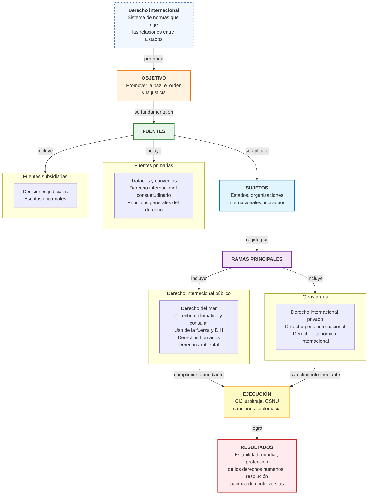

```mermaid
flowchart TD
    A[<b>Derecho internacional</b><br>Sistema de normas que rige<br>las relaciones entre Estados]:::title
    B[<b>OBJETIVO</b><br>Promover la paz, el orden<br>y la justicia]:::goal
    C[<b>FUENTES</b>]:::sources
    subgraph D[Fuentes primarias]
        D1[Tratados y convenios<br>Derecho internacional consuetudinario<br>Principios generales del derecho]
    end
    subgraph E[Fuentes subsidiarias]
        E1[Decisiones judiciales<br>Escritos doctrinales]
    end
    F[<b>SUJETOS</b><br>Estados, organizaciones<br>internacionales, individuos]:::subjects
    G[<b>RAMAS PRINCIPALES</b>]:::branches
    subgraph H[Derecho internacional público]
        H1[Derecho del mar<br>Derecho diplomático y consular<br>Uso de la fuerza y DIH<br>Derechos humanos<br>Derecho ambiental]
    end
    subgraph I[Otras áreas]
        I1[Derecho internacional privado<br>Derecho penal internacional<br>Derecho económico internacional]
    end
    J[<b>EJECUCIÓN</b><br>CIJ, arbitraje, CSNU<br>sanciones, diplomacia]:::enforcement
    K[<b>RESULTADOS</b><br>Estabilidad mundial, protección<br>de los derechos humanos, resolución<br>pacífica de controversias]:::outcome

    A -->|pretende| B
    B -->|se fundamenta en| C
    C -->|incluye| D
    C -->|incluye| E
    C -->|se aplica a| F
    F -->|regido por| G
    G -->|incluye| H
    G -->|incluye| I
    H & I -->|cumplimiento mediante| J
    J -->|logra| K

    classDef title fill:#f0f7ff,stroke:#4a6fa5,stroke-width:2px,color:#333,stroke-dasharray: 5 5
    classDef goal fill:#fff3e0,stroke:#ef6c00,stroke-width:2px,color:#333
    classDef sources fill:#e8f5e9,stroke:#2e7d32,stroke-width:2px,color:#333
    classDef subjects fill:#e1f5fe,stroke:#0277bd,stroke-width:2px,color:#333
    classDef branches fill:#f3e5f5,stroke:#6a1b9a,stroke-width:2px,color:#333
    classDef enforcement fill:#fff9c4,stroke:#f9a825,stroke-width:2px,color:#333
    classDef outcome fill:#ffebee,stroke:#c62828,stroke-width:2px,color:#333
```
