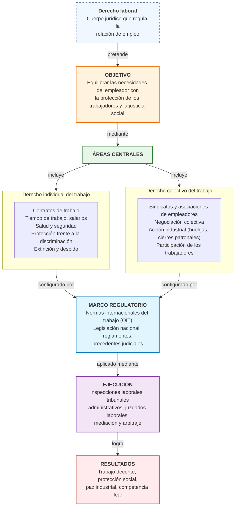

```mermaid
flowchart TD
    A[<b>Derecho laboral</b><br>Cuerpo jurídico que regula la<br>relación de empleo]:::title
    B[<b>OBJETIVO</b><br>Equilibrar las necesidades del empleador con<br>la protección de los trabajadores y la justicia social]:::goal
    C[<b>ÁREAS CENTRALES</b>]:::areas
    subgraph D[Derecho individual del trabajo]
        D1[Contratos de trabajo<br>Tiempo de trabajo, salarios<br>Salud y seguridad<br>Protección frente a la discriminación<br>Extinción y despido]
    end
    subgraph E[Derecho colectivo del trabajo]
        E1["Sindicatos y asociaciones de empleadores<br>Negociación colectiva<br>Acción industrial (huelgas, cierres patronales)<br>Participación de los trabajadores"]
    end
    F["<b>MARCO REGULATORIO</b><br>Normas internacionales del trabajo (OIT)<br>Legislación nacional, reglamentos,<br>precedentes judiciales"]:::framework
    G[<b>EJECUCIÓN</b><br>Inspecciones laborales, tribunales<br>administrativos, juzgados laborales,<br>mediación y arbitraje]:::enforcement
    H[<b>RESULTADOS</b><br>Trabajo decente, protección social,<br>paz industrial, competencia leal]:::outcome

    A -->|pretende| B
    B -->|mediante| C
    C -->|incluye| D
    C -->|incluye| E
    D & E -->|configurado por| F
    F -->|aplicado mediante| G
    G -->|logra| H

    classDef title fill:#f0f7ff,stroke:#4a6fa5,stroke-width:2px,color:#333,stroke-dasharray: 5 5
    classDef goal fill:#fff3e0,stroke:#ef6c00,stroke-width:2px,color:#333
    classDef areas fill:#e8f5e9,stroke:#2e7d32,stroke-width:2px,color:#333
    classDef framework fill:#e1f5fe,stroke:#0277bd,stroke-width:2px,color:#333
    classDef enforcement fill:#f3e5f5,stroke:#6a1b9a,stroke-width:2px,color:#333
    classDef outcome fill:#ffebee,stroke:#c62828,stroke-width:2px,color:#333
```
