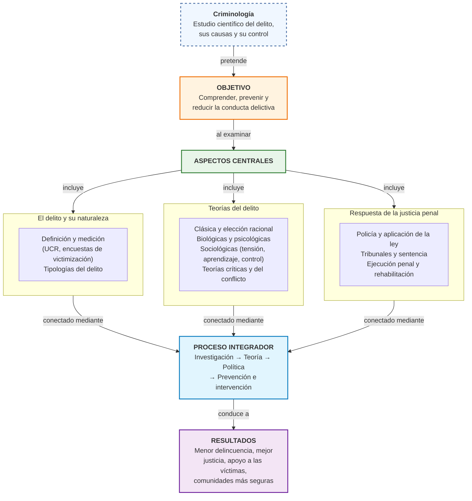

```mermaid
flowchart TD
    A[<b>Criminología</b><br>Estudio científico del delito,<br>sus causas y su control]:::title
    B[<b>OBJETIVO</b><br>Comprender, prevenir y<br>reducir la conducta delictiva]:::goal
    C[<b>ASPECTOS CENTRALES</b>]:::aspects
    subgraph D[El delito y su naturaleza]
        D1["Definición y medición<br>(UCR, encuestas de victimización)<br>Tipologías del delito"]
    end
    subgraph E[Teorías del delito]
        E1["Clásica y elección racional<br>Biológicas y psicológicas<br>Sociológicas (tensión, aprendizaje, control)<br>Teorías críticas y del conflicto"]
    end
    subgraph F[Respuesta de la justicia penal]
        F1[Policía y aplicación de la ley<br>Tribunales y sentencia<br>Ejecución penal y rehabilitación]
    end
    G[<b>PROCESO INTEGRADOR</b><br>Investigación → Teoría → Política<br>→ Prevención e intervención]:::process
    H[<b>RESULTADOS</b><br>Menor delincuencia, mejor<br>justicia, apoyo a las víctimas,<br>comunidades más seguras]:::outcome

    A -->|pretende| B
    B -->|al examinar| C
    C -->|incluye| D
    C -->|incluye| E
    C -->|incluye| F
    D & E & F -->|conectado mediante| G
    G -->|conduce a| H

    classDef title fill:#f0f7ff,stroke:#4a6fa5,stroke-width:2px,color:#333,stroke-dasharray: 5 5
    classDef goal fill:#fff3e0,stroke:#ef6c00,stroke-width:2px,color:#333
    classDef aspects fill:#e8f5e9,stroke:#2e7d32,stroke-width:2px,color:#333
    classDef process fill:#e1f5fe,stroke:#0277bd,stroke-width:2px,color:#333
    classDef outcome fill:#f3e5f5,stroke:#6a1b9a,stroke-width:2px,color:#333
```
