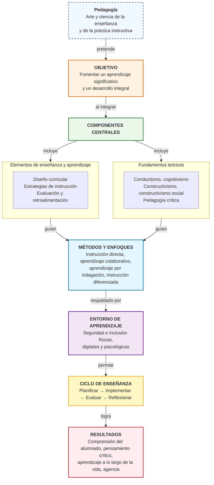

```mermaid
flowchart TD
    A[<b>Pedagogía</b><br>Arte y ciencia de la enseñanza<br>y de la práctica instructiva]:::title
    B[<b>OBJETIVO</b><br>Fomentar un aprendizaje significativo<br>y un desarrollo integral]:::goal
    C[<b>COMPONENTES CENTRALES</b>]:::components
    subgraph D[Elementos de enseñanza y aprendizaje]
        D1[Diseño curricular<br>Estrategias de instrucción<br>Evaluación y retroalimentación]
    end
    subgraph E[Fundamentos teóricos]
        E1[Conductismo, cognitivismo<br>Constructivismo, constructivismo social<br>Pedagogía crítica]
    end
    F[<b>MÉTODOS Y ENFOQUES</b><br>Instrucción directa, aprendizaje colaborativo,<br>aprendizaje por indagación, instrucción diferenciada]:::methods
    G[<b>ENTORNO DE APRENDIZAJE</b><br>Seguridad e inclusión físicas,<br>digitales y psicológicas]:::environment
    H[<b>CICLO DE ENSEÑANZA</b><br>Planificar → Implementar → Evaluar → Reflexionar]:::cycle
    I[<b>RESULTADOS</b><br>Comprensión del alumnado, pensamiento crítico,<br>aprendizaje a lo largo de la vida, agencia]:::outcome

    A -->|pretende| B
    B -->|al integrar| C
    C -->|incluye| D
    C -->|incluye| E
    D & E -->|guían| F
    F -->|respaldado por| G
    G -->|permite| H
    H -->|logra| I

    classDef title fill:#f0f7ff,stroke:#4a6fa5,stroke-width:2px,color:#333,stroke-dasharray: 5 5
    classDef goal fill:#fff3e0,stroke:#ef6c00,stroke-width:2px,color:#333
    classDef components fill:#e8f5e9,stroke:#2e7d32,stroke-width:2px,color:#333
    classDef methods fill:#e1f5fe,stroke:#0277bd,stroke-width:2px,color:#333
    classDef environment fill:#f3e5f5,stroke:#6a1b9a,stroke-width:2px,color:#333
    classDef cycle fill:#fff9c4,stroke:#f9a825,stroke-width:2px,color:#333
    classDef outcome fill:#ffebee,stroke:#c62828,stroke-width:2px,color:#333
```
