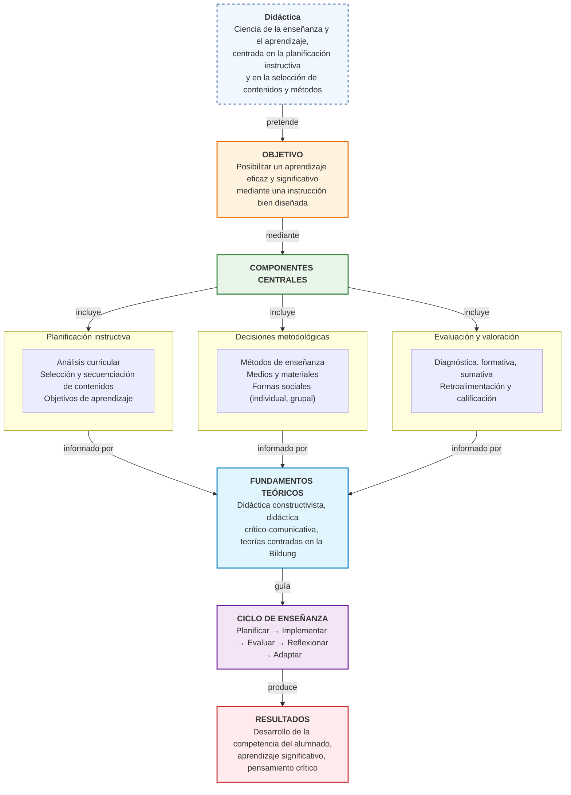

```mermaid
flowchart TD
    A[<b>Didáctica</b><br>Ciencia de la enseñanza y el aprendizaje,<br>centrada en la planificación instructiva<br>y en la selección de contenidos y métodos]:::title
    B[<b>OBJETIVO</b><br>Posibilitar un aprendizaje eficaz y significativo<br>mediante una instrucción bien diseñada]:::goal
    C[<b>COMPONENTES CENTRALES</b>]:::components
    subgraph D[Planificación instructiva]
        D1[Análisis curricular<br>Selección y secuenciación de contenidos<br>Objetivos de aprendizaje]
    end
    subgraph E[Decisiones metodológicas]
        E1["Métodos de enseñanza<br>Medios y materiales<br>Formas sociales (individual, grupal)"]
    end
    subgraph F[Evaluación y valoración]
        F1[Diagnóstica, formativa, sumativa<br>Retroalimentación y calificación]
    end
    G[<b>FUNDAMENTOS TEÓRICOS</b><br>Didáctica constructivista, didáctica<br>crítico-comunicativa, teorías centradas en la Bildung]:::theory
    H[<b>CICLO DE ENSEÑANZA</b><br>Planificar → Implementar → Evaluar → Reflexionar<br>→ Adaptar]:::cycle
    I[<b>RESULTADOS</b><br>Desarrollo de la competencia del alumnado,<br>aprendizaje significativo, pensamiento crítico]:::outcome

    A -->|pretende| B
    B -->|mediante| C
    C -->|incluye| D
    C -->|incluye| E
    C -->|incluye| F
    D & E & F -->|informado por| G
    G -->|guía| H
    H -->|produce| I

    classDef title fill:#f0f7ff,stroke:#4a6fa5,stroke-width:2px,color:#333,stroke-dasharray: 5 5
    classDef goal fill:#fff3e0,stroke:#ef6c00,stroke-width:2px,color:#333
    classDef components fill:#e8f5e9,stroke:#2e7d32,stroke-width:2px,color:#333
    classDef theory fill:#e1f5fe,stroke:#0277bd,stroke-width:2px,color:#333
    classDef cycle fill:#f3e5f5,stroke:#6a1b9a,stroke-width:2px,color:#333
    classDef outcome fill:#ffebee,stroke:#c62828,stroke-width:2px,color:#333
```
