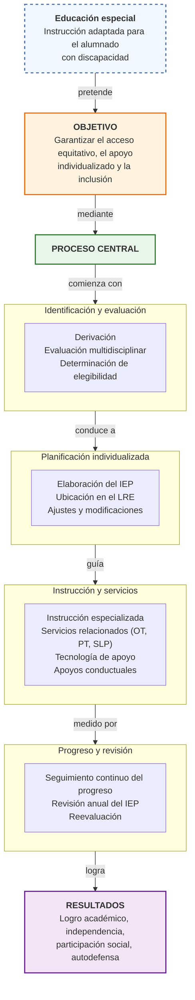

```mermaid
flowchart TD
    A[<b>Educación especial</b><br>Instrucción adaptada para el alumnado<br>con discapacidad]:::title
    B[<b>OBJETIVO</b><br>Garantizar el acceso equitativo, el apoyo<br>individualizado y la inclusión]:::goal
    C[<b>PROCESO CENTRAL</b>]:::process
    subgraph D[Identificación y evaluación]
        D1[Derivación<br>Evaluación multidisciplinar<br>Determinación de elegibilidad]
    end
    subgraph E[Planificación individualizada]
        E1[Elaboración del IEP<br>Ubicación en el LRE<br>Ajustes y modificaciones]
    end
    subgraph F[Instrucción y servicios]
        F1["Instrucción especializada<br>Servicios relacionados (OT, PT, SLP)<br>Tecnología de apoyo<br>Apoyos conductuales"]
    end
    subgraph G[Progreso y revisión]
        G1[Seguimiento continuo del progreso<br>Revisión anual del IEP<br>Reevaluación]
    end
    H[<b>RESULTADOS</b><br>Logro académico, independencia,<br>participación social, autodefensa]:::outcome

    A -->|pretende| B
    B -->|mediante| C
    C -->|comienza con| D
    D -->|conduce a| E
    E -->|guía| F
    F -->|medido por| G
    G -->|logra| H

    classDef title fill:#f0f7ff,stroke:#4a6fa5,stroke-width:2px,color:#333,stroke-dasharray: 5 5
    classDef goal fill:#fff3e0,stroke:#ef6c00,stroke-width:2px,color:#333
    classDef process fill:#e8f5e9,stroke:#2e7d32,stroke-width:2px,color:#333
    classDef outcome fill:#f3e5f5,stroke:#6a1b9a,stroke-width:2px,color:#333
```
