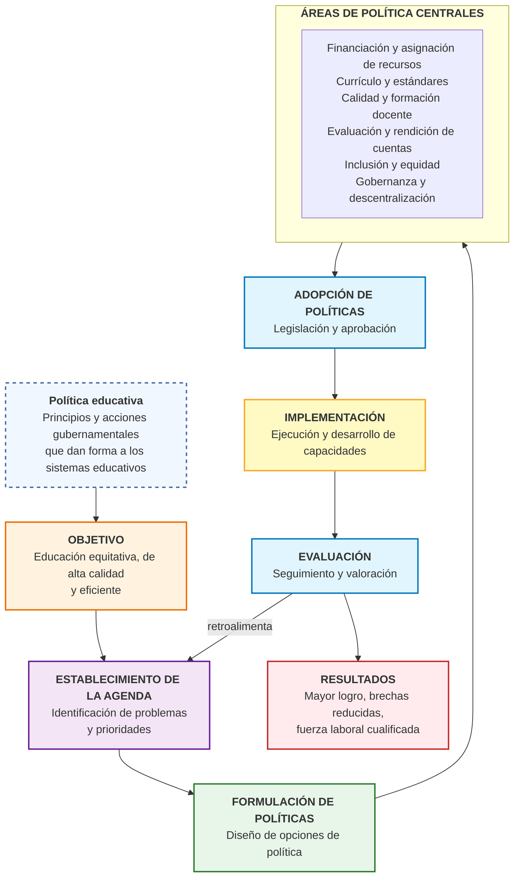

```mermaid
flowchart TD
    A[<b>Política educativa</b><br>Principios y acciones gubernamentales<br>que dan forma a los sistemas educativos]:::title
    B[<b>OBJETIVO</b><br>Educación equitativa, de alta calidad<br>y eficiente]:::goal
    C[<b>ESTABLECIMIENTO DE LA AGENDA</b><br>Identificación de problemas<br>y prioridades]:::agenda
    D[<b>FORMULACIÓN DE POLÍTICAS</b><br>Diseño de opciones de política]:::formulation
    subgraph E[<b>ÁREAS DE POLÍTICA CENTRALES</b>]
        E1[Financiación y asignación de recursos<br>Currículo y estándares<br>Calidad y formación docente<br>Evaluación y rendición de cuentas<br>Inclusión y equidad<br>Gobernanza y descentralización]
    end
    F[<b>ADOPCIÓN DE POLÍTICAS</b><br>Legislación y aprobación]:::adoption
    G[<b>IMPLEMENTACIÓN</b><br>Ejecución y desarrollo de capacidades]:::implementation
    H[<b>EVALUACIÓN</b><br>Seguimiento y valoración]:::evaluation
    I[<b>RESULTADOS</b><br>Mayor logro, brechas reducidas,<br>fuerza laboral cualificada]:::outcome

    A --> B --> C --> D
    D --> E
    E --> F --> G --> H
    H -->|retroalimenta| C
    H --> I

    classDef title fill:#f0f7ff,stroke:#4a6fa5,stroke-width:2px,color:#333,stroke-dasharray: 5 5
    classDef goal fill:#fff3e0,stroke:#ef6c00,stroke-width:2px,color:#333
    classDef agenda fill:#f3e5f5,stroke:#6a1b9a,stroke-width:2px,color:#333
    classDef formulation fill:#e8f5e9,stroke:#2e7d32,stroke-width:2px,color:#333
    classDef adoption fill:#e1f5fe,stroke:#0277bd,stroke-width:2px,color:#333
    classDef implementation fill:#fff9c4,stroke:#f9a825,stroke-width:2px,color:#333
    classDef evaluation fill:#e1f5fe,stroke:#0277bd,stroke-width:2px,color:#333
    classDef outcome fill:#ffebee,stroke:#c62828,stroke-width:2px,color:#333
```
