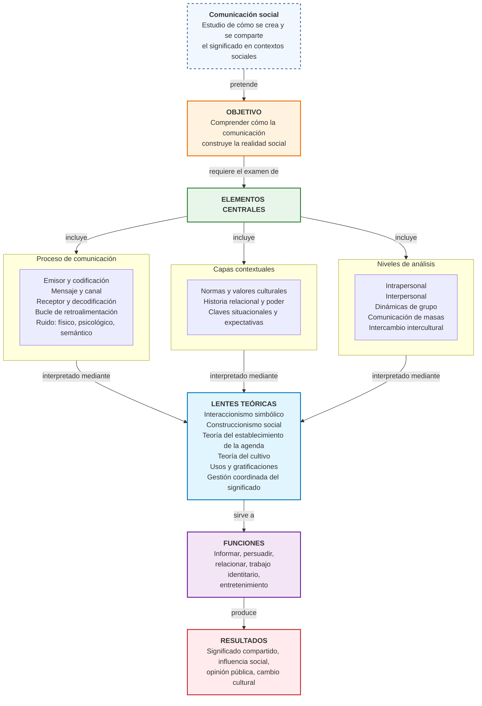

```mermaid
flowchart TD
    A[<b>Comunicación social</b><br>Estudio de cómo se crea y se comparte<br>el significado en contextos sociales]:::titulo
    B[<b>OBJETIVO</b><br>Comprender cómo la comunicación<br>construye la realidad social]:::goal
    C[<b>ELEMENTOS CENTRALES</b>]:::elements
    subgraph D[Proceso de comunicación]
        D1[Emisor y codificación<br>Mensaje y canal<br>Receptor y decodificación<br>Bucle de retroalimentación<br>Ruido: físico, psicológico, semántico]
    end
    subgraph E[Capas contextuales]
        E1[Normas y valores culturales<br>Historia relacional y poder<br>Claves situacionales y expectativas]
    end
    subgraph F[Niveles de análisis]
        F1[Intrapersonal<br>Interpersonal<br>Dinámicas de grupo<br>Comunicación de masas<br>Intercambio intercultural]
    end
    G[<b>LENTES TEÓRICAS</b><br>Interaccionismo simbólico<br>Construccionismo social<br>Teoría del establecimiento de la agenda<br>Teoría del cultivo<br>Usos y gratificaciones<br>Gestión coordinada del significado]:::theory
    H[<b>FUNCIONES</b><br>Informar, persuadir,<br>relacionar, trabajo identitario,<br>entretenimiento]:::functions
    I[<b>RESULTADOS</b><br>Significado compartido, influencia social,<br>opinión pública, cambio cultural]:::outcome

    A -->|pretende| B
    B -->|requiere el examen de| C
    C -->|incluye| D
    C -->|incluye| E
    C -->|incluye| F
    D & E & F -->|interpretado mediante| G
    G -->|sirve a| H
    H -->|produce| I

    classDef titulo fill:#f0f7ff,stroke:#4a6fa5,stroke-width:2px,color:#333,stroke-dasharray: 5 5
    classDef goal fill:#fff3e0,stroke:#ef6c00,stroke-width:2px,color:#333
    classDef elements fill:#e8f5e9,stroke:#2e7d32,stroke-width:2px,color:#333
    classDef theory fill:#e1f5fe,stroke:#0277bd,stroke-width:2px,color:#333
    classDef functions fill:#f3e5f5,stroke:#6a1b9a,stroke-width:2px,color:#333
    classDef outcome fill:#ffebee,stroke:#c62828,stroke-width:2px,color:#333
```
