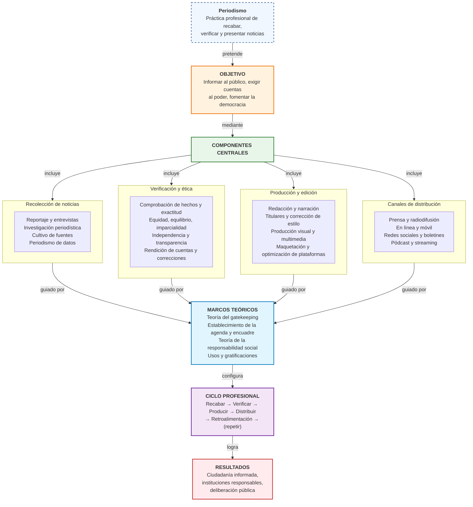

```mermaid
flowchart TD
    A[<b>Periodismo</b><br>Práctica profesional de recabar,<br>verificar y presentar noticias]:::title
    B[<b>OBJETIVO</b><br>Informar al público, exigir cuentas<br>al poder, fomentar la democracia]:::goal
    C[<b>COMPONENTES CENTRALES</b>]:::core
    subgraph D[Recolección de noticias]
        D1[Reportaje y entrevistas<br>Investigación periodística<br>Cultivo de fuentes<br>Periodismo de datos]
    end
    subgraph E[Verificación y ética]
        E1[Comprobación de hechos y exactitud<br>Equidad, equilibrio, imparcialidad<br>Independencia y transparencia<br>Rendición de cuentas y correcciones]
    end
    subgraph F[Producción y edición]
        F1[Redacción y narración<br>Titulares y corrección de estilo<br>Producción visual y multimedia<br>Maquetación y optimización de plataformas]
    end
    subgraph G[Canales de distribución]
        G1[Prensa y radiodifusión<br>En línea y móvil<br>Redes sociales y boletines<br>Pódcast y streaming]
    end
    H[<b>MARCOS TEÓRICOS</b><br>Teoría del gatekeeping<br>Establecimiento de la agenda y encuadre<br>Teoría de la responsabilidad social<br>Usos y gratificaciones]:::theory
    I["<b>CICLO PROFESIONAL</b><br>Recabar → Verificar → Producir → Distribuir<br>→ Retroalimentación → (repetir)"]:::process
    J[<b>RESULTADOS</b><br>Ciudadanía informada,<br>instituciones responsables,<br>deliberación pública]:::outcome

    A -->|pretende| B
    B -->|mediante| C
    C -->|incluye| D
    C -->|incluye| E
    C -->|incluye| F
    C -->|incluye| G
    D & E & F & G -->|guiado por| H
    H -->|configura| I
    I -->|logra| J

    classDef title fill:#f0f7ff,stroke:#4a6fa5,stroke-width:2px,color:#333,stroke-dasharray: 5 5
    classDef goal fill:#fff3e0,stroke:#ef6c00,stroke-width:2px,color:#333
    classDef core fill:#e8f5e9,stroke:#2e7d32,stroke-width:2px,color:#333
    classDef theory fill:#e1f5fe,stroke:#0277bd,stroke-width:2px,color:#333
    classDef process fill:#f3e5f5,stroke:#6a1b9a,stroke-width:2px,color:#333
    classDef outcome fill:#ffebee,stroke:#c62828,stroke-width:2px,color:#333
```
