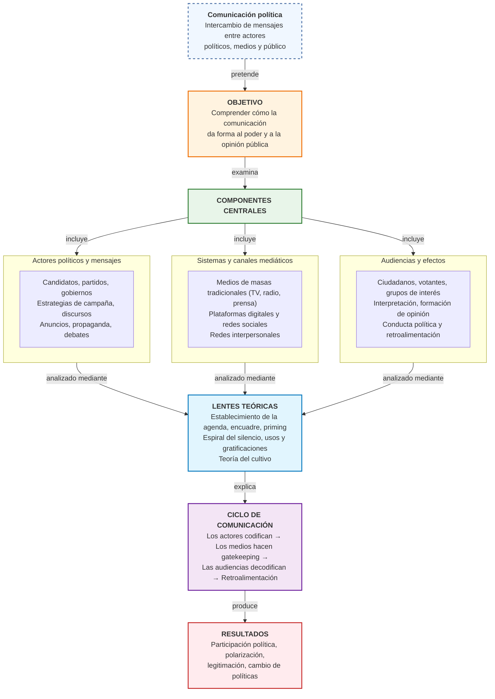

```mermaid
flowchart TD
    A[<b>Comunicación política</b><br>Intercambio de mensajes entre actores<br>políticos, medios y público]:::title
    B[<b>OBJETIVO</b><br>Comprender cómo la comunicación<br>da forma al poder y a la opinión pública]:::goal
    C[<b>COMPONENTES CENTRALES</b>]:::core
    subgraph D[Actores políticos y mensajes]
        D1[Candidatos, partidos, gobiernos<br>Estrategias de campaña, discursos<br>Anuncios, propaganda, debates]
    end
    subgraph E[Sistemas y canales mediáticos]
        E1["Medios de masas tradicionales (TV, radio, prensa)<br>Plataformas digitales y redes sociales<br>Redes interpersonales"]
    end
    subgraph F[Audiencias y efectos]
        F1[Ciudadanos, votantes, grupos de interés<br>Interpretación, formación de opinión<br>Conducta política y retroalimentación]
    end
    G[<b>LENTES TEÓRICAS</b><br>Establecimiento de la agenda, encuadre, priming<br>Espiral del silencio, usos y gratificaciones<br>Teoría del cultivo]:::theory
    H[<b>CICLO DE COMUNICACIÓN</b><br>Los actores codifican → Los medios hacen gatekeeping →<br>Las audiencias decodifican → Retroalimentación]:::process
    I[<b>RESULTADOS</b><br>Participación política, polarización,<br>legitimación, cambio de políticas]:::outcome

    A -->|pretende| B
    B -->|examina| C
    C -->|incluye| D
    C -->|incluye| E
    C -->|incluye| F
    D & E & F -->|analizado mediante| G
    G -->|explica| H
    H -->|produce| I

    classDef title fill:#f0f7ff,stroke:#4a6fa5,stroke-width:2px,color:#333,stroke-dasharray: 5 5
    classDef goal fill:#fff3e0,stroke:#ef6c00,stroke-width:2px,color:#333
    classDef core fill:#e8f5e9,stroke:#2e7d32,stroke-width:2px,color:#333
    classDef theory fill:#e1f5fe,stroke:#0277bd,stroke-width:2px,color:#333
    classDef process fill:#f3e5f5,stroke:#6a1b9a,stroke-width:2px,color:#333
    classDef outcome fill:#ffebee,stroke:#c62828,stroke-width:2px,color:#333
```
