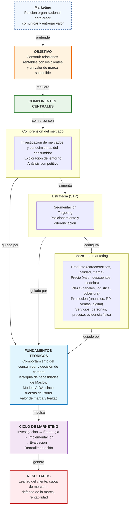

```mermaid
flowchart TD
    A[<b>Marketing</b><br>Función organizacional para crear,<br>comunicar y entregar valor]:::title
    B[<b>OBJETIVO</b><br>Construir relaciones rentables con los clientes<br>y un valor de marca sostenible]:::goal
    C[<b>COMPONENTES CENTRALES</b>]:::core
    subgraph D[Comprensión del mercado]
        D1[Investigación de mercados y conocimientos del consumidor<br>Exploración del entorno<br>Análisis competitivo]
    end
    subgraph E["Estrategia (STP)"]
        E1[Segmentación<br>Targeting<br>Posicionamiento y diferenciación]
    end
    subgraph F[Mezcla de marketing]
        F1["Producto (características, calidad, marca)<br>Precio (valor, descuentos, modelos)<br>Plaza (canales, logística, cobertura)<br>Promoción (anuncios, RP, ventas, digital)<br>Servicios: personas, proceso, evidencia física"]
    end
    G[<b>FUNDAMENTOS TEÓRICOS</b><br>Comportamiento del consumidor y decisión de compra<br>Jerarquía de necesidades de Maslow<br>Modelo AIDA, cinco fuerzas de Porter<br>Valor de marca y lealtad]:::theory
    H[<b>CICLO DE MARKETING</b><br>Investigación → Estrategia → Implementación<br>→ Evaluación → Retroalimentación]:::process
    I[<b>RESULTADOS</b><br>Lealtad del cliente, cuota de mercado,<br>defensa de la marca, rentabilidad]:::outcome

    A -->|pretende| B
    B -->|requiere| C
    C -->|comienza con| D
    D -->|alimenta| E
    E -->|configura| F
    D & E & F -->|guiado por| G
    G -->|impulsa| H
    H -->|genera| I

    classDef title fill:#f0f7ff,stroke:#4a6fa5,stroke-width:2px,color:#333,stroke-dasharray: 5 5
    classDef goal fill:#fff3e0,stroke:#ef6c00,stroke-width:2px,color:#333
    classDef core fill:#e8f5e9,stroke:#2e7d32,stroke-width:2px,color:#333
    classDef theory fill:#e1f5fe,stroke:#0277bd,stroke-width:2px,color:#333
    classDef process fill:#f3e5f5,stroke:#6a1b9a,stroke-width:2px,color:#333
    classDef outcome fill:#ffebee,stroke:#c62828,stroke-width:2px,color:#333
```
