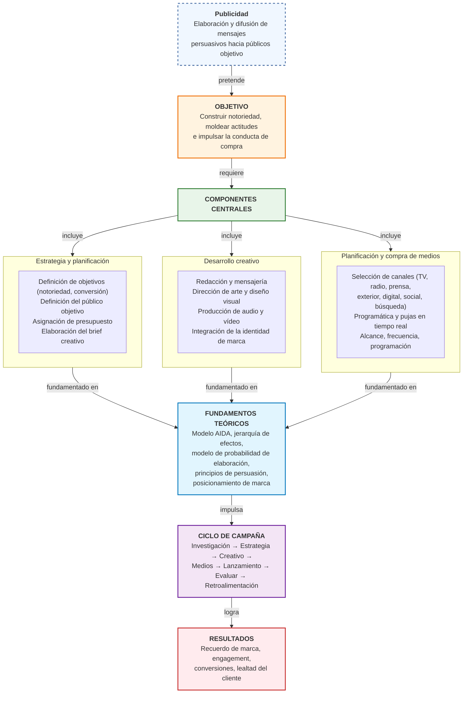

```mermaid
flowchart TD
    A[<b>Publicidad</b><br>Elaboración y difusión de mensajes<br>persuasivos hacia públicos objetivo]:::title
    B[<b>OBJETIVO</b><br>Construir notoriedad, moldear actitudes<br>e impulsar la conducta de compra]:::goal
    C[<b>COMPONENTES CENTRALES</b>]:::core
    subgraph D[Estrategia y planificación]
        D1["Definición de objetivos (notoriedad, conversión)<br>Definición del público objetivo<br>Asignación de presupuesto<br>Elaboración del brief creativo"]
    end
    subgraph E[Desarrollo creativo]
        E1[Redacción y mensajería<br>Dirección de arte y diseño visual<br>Producción de audio y vídeo<br>Integración de la identidad de marca]
    end
    subgraph F[Planificación y compra de medios]
        F1["Selección de canales (TV, radio, prensa,<br>exterior, digital, social, búsqueda)<br>Programática y pujas en tiempo real<br>Alcance, frecuencia, programación"]
    end
    G[<b>FUNDAMENTOS TEÓRICOS</b><br>Modelo AIDA, jerarquía de efectos,<br>modelo de probabilidad de elaboración,<br>principios de persuasión,<br>posicionamiento de marca]:::theory
    H[<b>CICLO DE CAMPAÑA</b><br>Investigación → Estrategia → Creativo →<br>Medios → Lanzamiento → Evaluar → Retroalimentación]:::process
    I[<b>RESULTADOS</b><br>Recuerdo de marca, engagement,<br>conversiones, lealtad del cliente]:::outcome

    A -->|pretende| B
    B -->|requiere| C
    C -->|incluye| D
    C -->|incluye| E
    C -->|incluye| F
    D & E & F -->|fundamentado en| G
    G -->|impulsa| H
    H -->|logra| I

    classDef title fill:#f0f7ff,stroke:#4a6fa5,stroke-width:2px,color:#333,stroke-dasharray: 5 5
    classDef goal fill:#fff3e0,stroke:#ef6c00,stroke-width:2px,color:#333
    classDef core fill:#e8f5e9,stroke:#2e7d32,stroke-width:2px,color:#333
    classDef theory fill:#e1f5fe,stroke:#0277bd,stroke-width:2px,color:#333
    classDef process fill:#f3e5f5,stroke:#6a1b9a,stroke-width:2px,color:#333
    classDef outcome fill:#ffebee,stroke:#c62828,stroke-width:2px,color:#333
```
