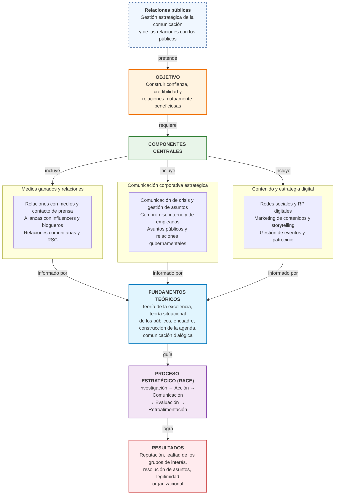

```mermaid
flowchart TD
    A[<b>Relaciones públicas</b><br>Gestión estratégica de la comunicación<br>y de las relaciones con los públicos]:::title
    B[<b>OBJETIVO</b><br>Construir confianza, credibilidad y<br>relaciones mutuamente beneficiosas]:::goal
    C[<b>COMPONENTES CENTRALES</b>]:::core
    subgraph D[Medios ganados y relaciones]
        D1[Relaciones con medios y contacto de prensa<br>Alianzas con influencers y blogueros<br>Relaciones comunitarias y RSC]
    end
    subgraph E[Comunicación corporativa estratégica]
        E1[Comunicación de crisis y gestión de asuntos<br>Compromiso interno y de empleados<br>Asuntos públicos y relaciones gubernamentales]
    end
    subgraph F[Contenido y estrategia digital]
        F1[Redes sociales y RP digitales<br>Marketing de contenidos y storytelling<br>Gestión de eventos y patrocinio]
    end
    G[<b>FUNDAMENTOS TEÓRICOS</b><br>Teoría de la excelencia, teoría situacional<br>de los públicos, encuadre, construcción de la agenda,<br>comunicación dialógica]:::theory
    H["<b>PROCESO ESTRATÉGICO (RACE)</b><br>Investigación → Acción → Comunicación<br>→ Evaluación → Retroalimentación"]:::process
    I[<b>RESULTADOS</b><br>Reputación, lealtad de los grupos de interés,<br>resolución de asuntos, legitimidad<br>organizacional]:::outcome

    A -->|pretende| B
    B -->|requiere| C
    C -->|incluye| D
    C -->|incluye| E
    C -->|incluye| F
    D & E & F -->|informado por| G
    G -->|guía| H
    H -->|logra| I

    classDef title fill:#f0f7ff,stroke:#4a6fa5,stroke-width:2px,color:#333,stroke-dasharray: 5 5
    classDef goal fill:#fff3e0,stroke:#ef6c00,stroke-width:2px,color:#333
    classDef core fill:#e8f5e9,stroke:#2e7d32,stroke-width:2px,color:#333
    classDef theory fill:#e1f5fe,stroke:#0277bd,stroke-width:2px,color:#333
    classDef process fill:#f3e5f5,stroke:#6a1b9a,stroke-width:2px,color:#333
    classDef outcome fill:#ffebee,stroke:#c62828,stroke-width:2px,color:#333
```
