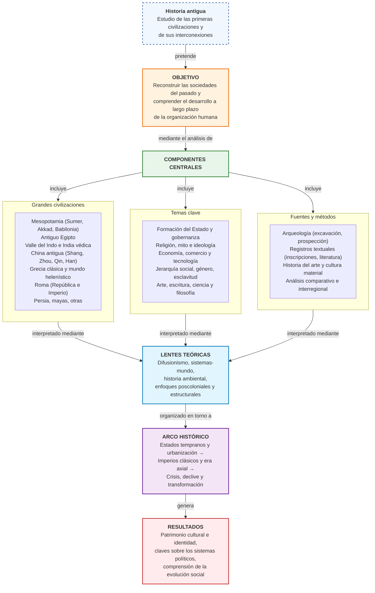

```mermaid
flowchart TD
    A[<b>Historia antigua</b><br>Estudio de las primeras civilizaciones y<br>de sus interconexiones]:::title
    B[<b>OBJETIVO</b><br>Reconstruir las sociedades del pasado y<br>comprender el desarrollo a largo plazo<br>de la organización humana]:::goal
    C[<b>COMPONENTES CENTRALES</b>]:::core
    subgraph D[Grandes civilizaciones]
        D1["Mesopotamia (Sumer, Akkad, Babilonia)<br>Antiguo Egipto<br>Valle del Indo e India védica<br>China antigua (Shang, Zhou, Qin, Han)<br>Grecia clásica y mundo helenístico<br>Roma (República e Imperio)<br>Persia, mayas, otras"]
    end
    subgraph E[Temas clave]
        E1[Formación del Estado y gobernanza<br>Religión, mito e ideología<br>Economía, comercio y tecnología<br>Jerarquía social, género, esclavitud<br>Arte, escritura, ciencia y filosofía]
    end
    subgraph F[Fuentes y métodos]
        F1["Arqueología (excavación, prospección)<br>Registros textuales (inscripciones, literatura)<br>Historia del arte y cultura material<br>Análisis comparativo e interregional"]
    end
    G[<b>LENTES TEÓRICAS</b><br>Difusionismo, sistemas-mundo,<br>historia ambiental,<br>enfoques poscoloniales y estructurales]:::theory
    H[<b>ARCO HISTÓRICO</b><br>Estados tempranos y urbanización →<br>Imperios clásicos y era axial →<br>Crisis, declive y transformación]:::process
    I[<b>RESULTADOS</b><br>Patrimonio cultural e identidad,<br>claves sobre los sistemas políticos,<br>comprensión de la evolución social]:::outcome

    A -->|pretende| B
    B -->|mediante el análisis de| C
    C -->|incluye| D
    C -->|incluye| E
    C -->|incluye| F
    D & E & F -->|interpretado mediante| G
    G -->|organizado en torno a| H
    H -->|genera| I

    classDef title fill:#f0f7ff,stroke:#4a6fa5,stroke-width:2px,color:#333,stroke-dasharray: 5 5
    classDef goal fill:#fff3e0,stroke:#ef6c00,stroke-width:2px,color:#333
    classDef core fill:#e8f5e9,stroke:#2e7d32,stroke-width:2px,color:#333
    classDef theory fill:#e1f5fe,stroke:#0277bd,stroke-width:2px,color:#333
    classDef process fill:#f3e5f5,stroke:#6a1b9a,stroke-width:2px,color:#333
    classDef outcome fill:#ffebee,stroke:#c62828,stroke-width:2px,color:#333
```
