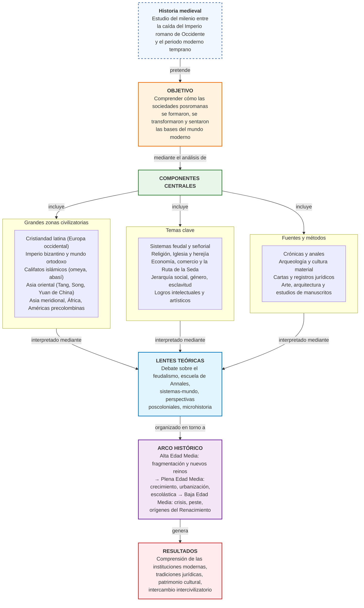

```mermaid
flowchart TD
    A[<b>Historia medieval</b><br>Estudio del milenio entre<br>la caída del Imperio romano de Occidente<br>y el periodo moderno temprano]:::title
    B[<b>OBJETIVO</b><br>Comprender cómo las sociedades posromanas<br>se formaron, se transformaron y sentaron<br>las bases del mundo moderno]:::goal
    C[<b>COMPONENTES CENTRALES</b>]:::core
    subgraph D[Grandes zonas civilizatorias]
        D1["Cristiandad latina (Europa occidental)<br>Imperio bizantino y mundo ortodoxo<br>Califatos islámicos (omeya, abasí)<br>Asia oriental (Tang, Song, Yuan de China)<br>Asia meridional, África, Américas precolombinas"]
    end
    subgraph E[Temas clave]
        E1[Sistemas feudal y señorial<br>Religión, Iglesia y herejía<br>Economía, comercio y la Ruta de la Seda<br>Jerarquía social, género, esclavitud<br>Logros intelectuales y artísticos]
    end
    subgraph F[Fuentes y métodos]
        F1[Crónicas y anales<br>Arqueología y cultura material<br>Cartas y registros jurídicos<br>Arte, arquitectura y estudios de manuscritos]
    end
    G[<b>LENTES TEÓRICAS</b><br>Debate sobre el feudalismo, escuela de Annales,<br>sistemas-mundo, perspectivas<br>poscoloniales, microhistoria]:::theory
    H[<b>ARCO HISTÓRICO</b><br>Alta Edad Media: fragmentación y nuevos reinos<br>→ Plena Edad Media: crecimiento, urbanización,<br>escolástica → Baja Edad Media: crisis, peste,<br>orígenes del Renacimiento]:::process
    I[<b>RESULTADOS</b><br>Comprensión de las instituciones modernas,<br>tradiciones jurídicas, patrimonio cultural,<br>intercambio intercivilizatorio]:::outcome

    A -->|pretende| B
    B -->|mediante el análisis de| C
    C -->|incluye| D
    C -->|incluye| E
    C -->|incluye| F
    D & E & F -->|interpretado mediante| G
    G -->|organizado en torno a| H
    H -->|genera| I

    classDef title fill:#f0f7ff,stroke:#4a6fa5,stroke-width:2px,color:#333,stroke-dasharray: 5 5
    classDef goal fill:#fff3e0,stroke:#ef6c00,stroke-width:2px,color:#333
    classDef core fill:#e8f5e9,stroke:#2e7d32,stroke-width:2px,color:#333
    classDef theory fill:#e1f5fe,stroke:#0277bd,stroke-width:2px,color:#333
    classDef process fill:#f3e5f5,stroke:#6a1b9a,stroke-width:2px,color:#333
    classDef outcome fill:#ffebee,stroke:#c62828,stroke-width:2px,color:#333
```
