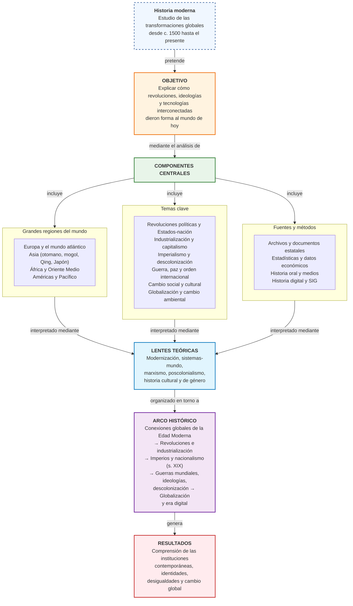

```mermaid
flowchart TD
    A[<b>Historia moderna</b><br>Estudio de las transformaciones globales<br>desde c. 1500 hasta el presente]:::title
    B[<b>OBJETIVO</b><br>Explicar cómo revoluciones, ideologías<br>y tecnologías interconectadas<br>dieron forma al mundo de hoy]:::goal
    C[<b>COMPONENTES CENTRALES</b>]:::core
    subgraph D[Grandes regiones del mundo]
        D1["Europa y el mundo atlántico<br>Asia (otomano, mogol, Qing, Japón)<br>África y Oriente Medio<br>Américas y Pacífico"]
    end
    subgraph E[Temas clave]
        E1[Revoluciones políticas y Estados-nación<br>Industrialización y capitalismo<br>Imperialismo y descolonización<br>Guerra, paz y orden internacional<br>Cambio social y cultural<br>Globalización y cambio ambiental]
    end
    subgraph F[Fuentes y métodos]
        F1[Archivos y documentos estatales<br>Estadísticas y datos económicos<br>Historia oral y medios<br>Historia digital y SIG]
    end
    G[<b>LENTES TEÓRICAS</b><br>Modernización, sistemas-mundo,<br>marxismo, poscolonialismo,<br>historia cultural y de género]:::theory
    H["<b>ARCO HISTÓRICO</b><br>Conexiones globales de la Edad Moderna<br>→ Revoluciones e industrialización<br>→ Imperios y nacionalismo (s. XIX)<br>→ Guerras mundiales, ideologías,<br>descolonización → Globalización<br>y era digital"]:::process
    I[<b>RESULTADOS</b><br>Comprensión de las instituciones<br>contemporáneas, identidades,<br>desigualdades y cambio global]:::outcome

    A -->|pretende| B
    B -->|mediante el análisis de| C
    C -->|incluye| D
    C -->|incluye| E
    C -->|incluye| F
    D & E & F -->|interpretado mediante| G
    G -->|organizado en torno a| H
    H -->|genera| I

    classDef title fill:#f0f7ff,stroke:#4a6fa5,stroke-width:2px,color:#333,stroke-dasharray: 5 5
    classDef goal fill:#fff3e0,stroke:#ef6c00,stroke-width:2px,color:#333
    classDef core fill:#e8f5e9,stroke:#2e7d32,stroke-width:2px,color:#333
    classDef theory fill:#e1f5fe,stroke:#0277bd,stroke-width:2px,color:#333
    classDef process fill:#f3e5f5,stroke:#6a1b9a,stroke-width:2px,color:#333
    classDef outcome fill:#ffebee,stroke:#c62828,stroke-width:2px,color:#333
```
