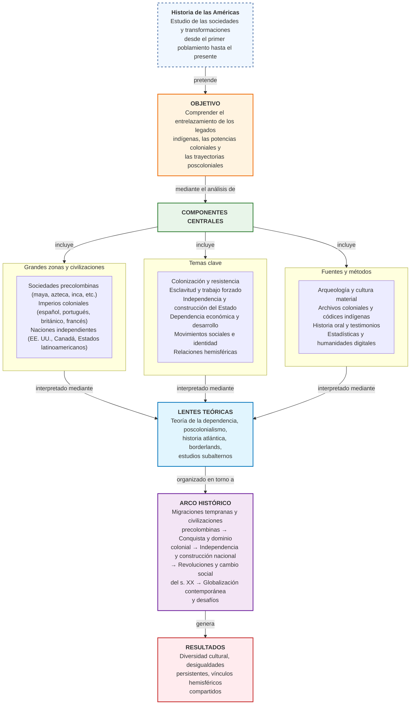

```mermaid
flowchart TD
    A[<b>Historia de las Américas</b><br>Estudio de las sociedades y transformaciones<br>desde el primer poblamiento hasta el presente]:::title
    B[<b>OBJETIVO</b><br>Comprender el entrelazamiento de los legados<br>indígenas, las potencias coloniales y<br>las trayectorias poscoloniales]:::goal
    C[<b>COMPONENTES CENTRALES</b>]:::core
    subgraph D[Grandes zonas y civilizaciones]
        D1["Sociedades precolombinas (maya, azteca, inca, etc.)<br>Imperios coloniales (español, portugués, británico, francés)<br>Naciones independientes (EE. UU., Canadá, Estados latinoamericanos)"]
    end
    subgraph E[Temas clave]
        E1[Colonización y resistencia<br>Esclavitud y trabajo forzado<br>Independencia y construcción del Estado<br>Dependencia económica y desarrollo<br>Movimientos sociales e identidad<br>Relaciones hemisféricas]
    end
    subgraph F[Fuentes y métodos]
        F1[Arqueología y cultura material<br>Archivos coloniales y códices indígenas<br>Historia oral y testimonios<br>Estadísticas y humanidades digitales]
    end
    G[<b>LENTES TEÓRICAS</b><br>Teoría de la dependencia, poscolonialismo,<br>historia atlántica, borderlands,<br>estudios subalternos]:::theory
    H[<b>ARCO HISTÓRICO</b><br>Migraciones tempranas y civilizaciones<br>precolombinas → Conquista y dominio<br>colonial → Independencia y construcción nacional<br>→ Revoluciones y cambio social<br>del s. XX → Globalización contemporánea<br>y desafíos]:::process
    I[<b>RESULTADOS</b><br>Diversidad cultural, desigualdades<br>persistentes, vínculos hemisféricos<br>compartidos]:::outcome

    A -->|pretende| B
    B -->|mediante el análisis de| C
    C -->|incluye| D
    C -->|incluye| E
    C -->|incluye| F
    D & E & F -->|interpretado mediante| G
    G -->|organizado en torno a| H
    H -->|genera| I

    classDef title fill:#f0f7ff,stroke:#4a6fa5,stroke-width:2px,color:#333,stroke-dasharray: 5 5
    classDef goal fill:#fff3e0,stroke:#ef6c00,stroke-width:2px,color:#333
    classDef core fill:#e8f5e9,stroke:#2e7d32,stroke-width:2px,color:#333
    classDef theory fill:#e1f5fe,stroke:#0277bd,stroke-width:2px,color:#333
    classDef process fill:#f3e5f5,stroke:#6a1b9a,stroke-width:2px,color:#333
    classDef outcome fill:#ffebee,stroke:#c62828,stroke-width:2px,color:#333
```
