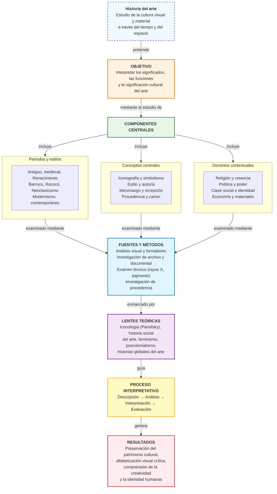

```mermaid
flowchart TD
    A[<b>Historia del arte</b><br>Estudio de la cultura visual y material<br>a través del tiempo y del espacio]:::title
    B[<b>OBJETIVO</b><br>Interpretar los significados, las funciones<br>y la significación cultural del arte]:::goal
    C[<b>COMPONENTES CENTRALES</b>]:::core
    subgraph D[Periodos y estilos]
        D1[Antiguo, medieval, Renacimiento<br>Barroco, Rococó, Neoclasicismo<br>Modernismo, contemporáneo]
    end
    subgraph E[Conceptos centrales]
        E1[Iconografía y simbolismo<br>Estilo y autoría<br>Mecenazgo y recepción<br>Procedencia y canon]
    end
    subgraph F[Dominios contextuales]
        F1[Religión y creencia<br>Política y poder<br>Clase social e identidad<br>Economía y materiales]
    end
    G["<b>FUENTES Y MÉTODOS</b><br>Análisis visual y formalismo<br>Investigación de archivo y documental<br>Examen técnico (rayos X, pigmento)<br>Investigación de procedencia"]:::methods
    H["<b>LENTES TEÓRICAS</b><br>Iconología (Panofsky), historia social<br>del arte, feminismo, poscolonialismo,<br>historias globales del arte"]:::theory
    I[<b>PROCESO INTERPRETATIVO</b><br>Descripción → Análisis →<br>Interpretación → Evaluación]:::process
    J[<b>RESULTADOS</b><br>Preservación del patrimonio cultural,<br>alfabetización visual crítica,<br>comprensión de la creatividad<br>y la identidad humanas]:::outcome

    A -->|pretende| B
    B -->|mediante el estudio de| C
    C -->|incluye| D
    C -->|incluye| E
    C -->|incluye| F
    D & E & F -->|examinado mediante| G
    G -->|enmarcado por| H
    H -->|guía| I
    I -->|genera| J

    classDef title fill:#f0f7ff,stroke:#4a6fa5,stroke-width:2px,color:#333,stroke-dasharray: 5 5
    classDef goal fill:#fff3e0,stroke:#ef6c00,stroke-width:2px,color:#333
    classDef core fill:#e8f5e9,stroke:#2e7d32,stroke-width:2px,color:#333
    classDef methods fill:#e1f5fe,stroke:#0277bd,stroke-width:2px,color:#333
    classDef theory fill:#f3e5f5,stroke:#6a1b9a,stroke-width:2px,color:#333
    classDef process fill:#fff9c4,stroke:#f9a825,stroke-width:2px,color:#333
    classDef outcome fill:#ffebee,stroke:#c62828,stroke-width:2px,color:#333
```
