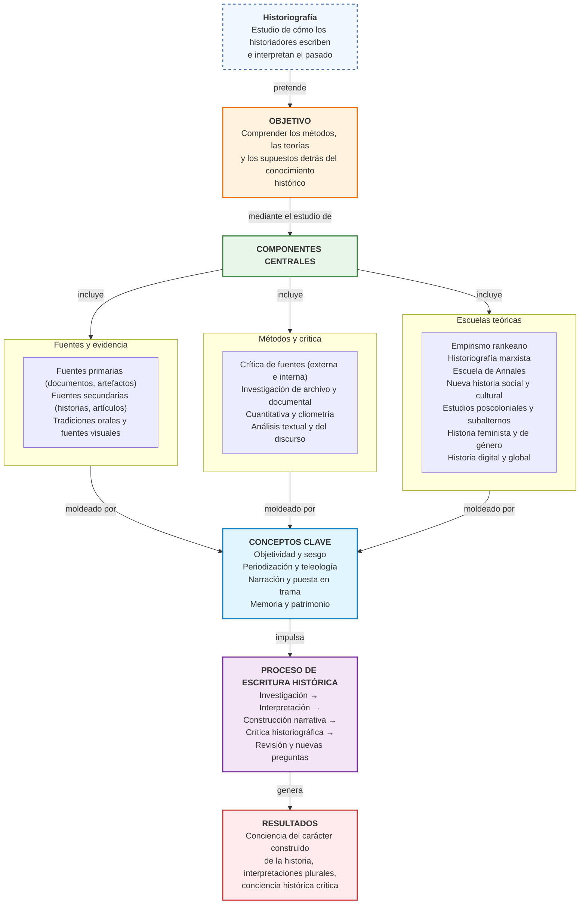

```mermaid
flowchart TD
    A[<b>Historiografía</b><br>Estudio de cómo los historiadores escriben<br>e interpretan el pasado]:::title
    B[<b>OBJETIVO</b><br>Comprender los métodos, las teorías<br>y los supuestos detrás del conocimiento<br>histórico]:::goal
    C[<b>COMPONENTES CENTRALES</b>]:::core
    subgraph D[Fuentes y evidencia]
        D1["Fuentes primarias (documentos, artefactos)<br>Fuentes secundarias (historias, artículos)<br>Tradiciones orales y fuentes visuales"]
    end
    subgraph E[Métodos y crítica]
        E1["Crítica de fuentes (externa e interna)<br>Investigación de archivo y documental<br>Cuantitativa y cliometría<br>Análisis textual y del discurso"]
    end
    subgraph F[Escuelas teóricas]
        F1[Empirismo rankeano<br>Historiografía marxista<br>Escuela de Annales<br>Nueva historia social y cultural<br>Estudios poscoloniales y subalternos<br>Historia feminista y de género<br>Historia digital y global]
    end
    G[<b>CONCEPTOS CLAVE</b><br>Objetividad y sesgo<br>Periodización y teleología<br>Narración y puesta en trama<br>Memoria y patrimonio]:::concepts
    H[<b>PROCESO DE ESCRITURA HISTÓRICA</b><br>Investigación → Interpretación →<br>Construcción narrativa →<br>Crítica historiográfica →<br>Revisión y nuevas preguntas]:::process
    I[<b>RESULTADOS</b><br>Conciencia del carácter construido<br>de la historia, interpretaciones plurales,<br>conciencia histórica crítica]:::outcome

    A -->|pretende| B
    B -->|mediante el estudio de| C
    C -->|incluye| D
    C -->|incluye| E
    C -->|incluye| F
    D & E & F -->|moldeado por| G
    G -->|impulsa| H
    H -->|genera| I

    classDef title fill:#f0f7ff,stroke:#4a6fa5,stroke-width:2px,color:#333,stroke-dasharray: 5 5
    classDef goal fill:#fff3e0,stroke:#ef6c00,stroke-width:2px,color:#333
    classDef core fill:#e8f5e9,stroke:#2e7d32,stroke-width:2px,color:#333
    classDef concepts fill:#e1f5fe,stroke:#0277bd,stroke-width:2px,color:#333
    classDef process fill:#f3e5f5,stroke:#6a1b9a,stroke-width:2px,color:#333
    classDef outcome fill:#ffebee,stroke:#c62828,stroke-width:2px,color:#333
```
