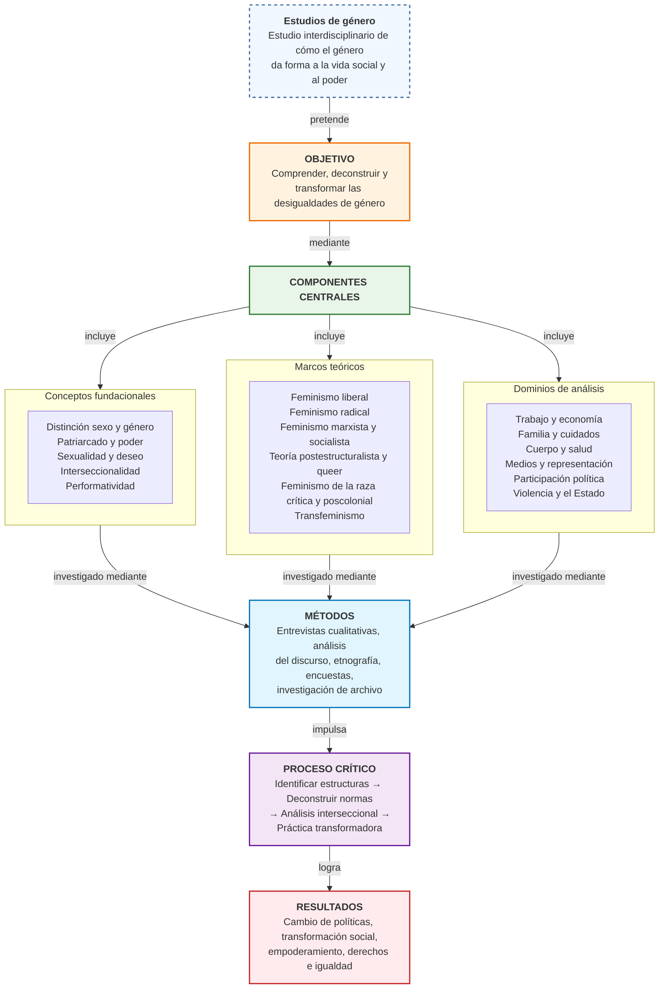

```mermaid
flowchart TD
    A[<b>Estudios de género</b><br>Estudio interdisciplinario de cómo el género<br>da forma a la vida social y al poder]:::title
    B[<b>OBJETIVO</b><br>Comprender, deconstruir y<br>transformar las desigualdades de género]:::goal
    C[<b>COMPONENTES CENTRALES</b>]:::core
    subgraph D[Conceptos fundacionales]
        D1[Distinción sexo y género<br>Patriarcado y poder<br>Sexualidad y deseo<br>Interseccionalidad<br>Performatividad]
    end
    subgraph E[Marcos teóricos]
        E1[Feminismo liberal<br>Feminismo radical<br>Feminismo marxista y socialista<br>Teoría postestructuralista y queer<br>Feminismo de la raza crítica y poscolonial<br>Transfeminismo]
    end
    subgraph F[Dominios de análisis]
        F1[Trabajo y economía<br>Familia y cuidados<br>Cuerpo y salud<br>Medios y representación<br>Participación política<br>Violencia y el Estado]
    end
    G[<b>MÉTODOS</b><br>Entrevistas cualitativas, análisis<br>del discurso, etnografía, encuestas,<br>investigación de archivo]:::methods
    H[<b>PROCESO CRÍTICO</b><br>Identificar estructuras → Deconstruir normas<br>→ Análisis interseccional →<br>Práctica transformadora]:::process
    I[<b>RESULTADOS</b><br>Cambio de políticas, transformación social,<br>empoderamiento, derechos e igualdad]:::outcome

    A -->|pretende| B
    B -->|mediante| C
    C -->|incluye| D
    C -->|incluye| E
    C -->|incluye| F
    D & E & F -->|investigado mediante| G
    G -->|impulsa| H
    H -->|logra| I

    classDef title fill:#f0f7ff,stroke:#4a6fa5,stroke-width:2px,color:#333,stroke-dasharray: 5 5
    classDef goal fill:#fff3e0,stroke:#ef6c00,stroke-width:2px,color:#333
    classDef core fill:#e8f5e9,stroke:#2e7d32,stroke-width:2px,color:#333
    classDef methods fill:#e1f5fe,stroke:#0277bd,stroke-width:2px,color:#333
    classDef process fill:#f3e5f5,stroke:#6a1b9a,stroke-width:2px,color:#333
    classDef outcome fill:#ffebee,stroke:#c62828,stroke-width:2px,color:#333
```
