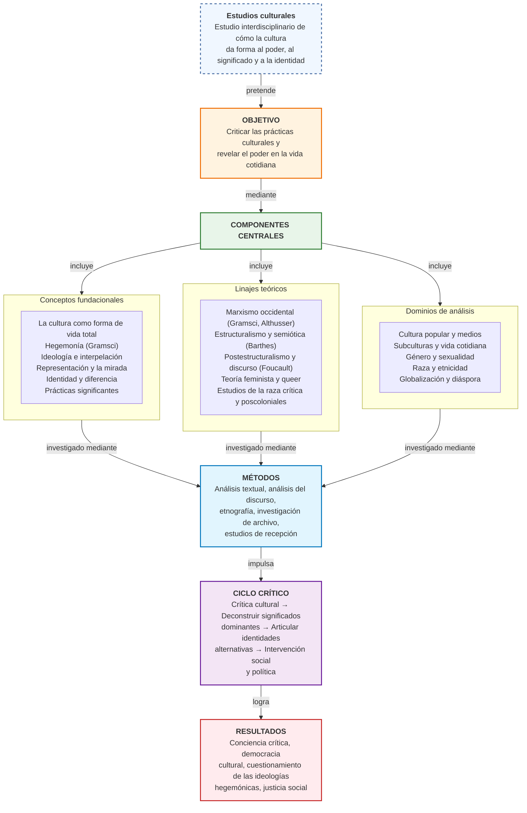

```mermaid
flowchart TD
    A[<b>Estudios culturales</b><br>Estudio interdisciplinario de cómo la cultura<br>da forma al poder, al significado y a la identidad]:::title
    B[<b>OBJETIVO</b><br>Criticar las prácticas culturales y<br>revelar el poder en la vida cotidiana]:::goal
    C[<b>COMPONENTES CENTRALES</b>]:::core
    subgraph D[Conceptos fundacionales]
        D1["La cultura como forma de vida total<br>Hegemonía (Gramsci)<br>Ideología e interpelación<br>Representación y la mirada<br>Identidad y diferencia<br>Prácticas significantes"]
    end
    subgraph E[Linajes teóricos]
        E1["Marxismo occidental (Gramsci, Althusser)<br>Estructuralismo y semiótica (Barthes)<br>Postestructuralismo y discurso (Foucault)<br>Teoría feminista y queer<br>Estudios de la raza crítica y poscoloniales"]
    end
    subgraph F[Dominios de análisis]
        F1[Cultura popular y medios<br>Subculturas y vida cotidiana<br>Género y sexualidad<br>Raza y etnicidad<br>Globalización y diáspora]
    end
    G[<b>MÉTODOS</b><br>Análisis textual, análisis del discurso,<br>etnografía, investigación de archivo,<br>estudios de recepción]:::methods
    H[<b>CICLO CRÍTICO</b><br>Crítica cultural → Deconstruir significados<br>dominantes → Articular identidades<br>alternativas → Intervención social<br>y política]:::process
    I[<b>RESULTADOS</b><br>Conciencia crítica, democracia<br>cultural, cuestionamiento de las ideologías<br>hegemónicas, justicia social]:::outcome

    A -->|pretende| B
    B -->|mediante| C
    C -->|incluye| D
    C -->|incluye| E
    C -->|incluye| F
    D & E & F -->|investigado mediante| G
    G -->|impulsa| H
    H -->|logra| I

    classDef title fill:#f0f7ff,stroke:#4a6fa5,stroke-width:2px,color:#333,stroke-dasharray: 5 5
    classDef goal fill:#fff3e0,stroke:#ef6c00,stroke-width:2px,color:#333
    classDef core fill:#e8f5e9,stroke:#2e7d32,stroke-width:2px,color:#333
    classDef methods fill:#e1f5fe,stroke:#0277bd,stroke-width:2px,color:#333
    classDef process fill:#f3e5f5,stroke:#6a1b9a,stroke-width:2px,color:#333
    classDef outcome fill:#ffebee,stroke:#c62828,stroke-width:2px,color:#333
```
