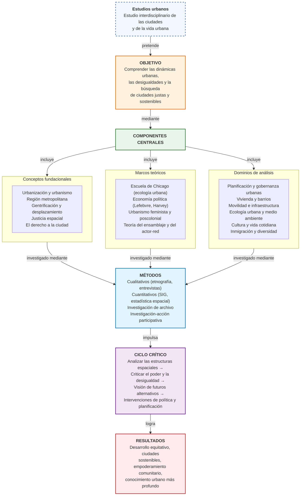

```mermaid
flowchart TD
    A[<b>Estudios urbanos</b><br>Estudio interdisciplinario de las ciudades<br>y de la vida urbana]:::title
    B[<b>OBJETIVO</b><br>Comprender las dinámicas urbanas,<br>las desigualdades y la búsqueda<br>de ciudades justas y sostenibles]:::goal
    C[<b>COMPONENTES CENTRALES</b>]:::core
    subgraph D[Conceptos fundacionales]
        D1[Urbanización y urbanismo<br>Región metropolitana<br>Gentrificación y desplazamiento<br>Justicia espacial<br>El derecho a la ciudad]
    end
    subgraph E[Marcos teóricos]
        E1["Escuela de Chicago (ecología urbana)<br>Economía política (Lefebvre, Harvey)<br>Urbanismo feminista y poscolonial<br>Teoría del ensamblaje y del actor-red"]
    end
    subgraph F[Dominios de análisis]
        F1[Planificación y gobernanza urbanas<br>Vivienda y barrios<br>Movilidad e infraestructura<br>Ecología urbana y medio ambiente<br>Cultura y vida cotidiana<br>Inmigración y diversidad]
    end
    G["<b>MÉTODOS</b><br>Cualitativos (etnografía, entrevistas)<br>Cuantitativos (SIG, estadística espacial)<br>Investigación de archivo<br>Investigación-acción participativa"]:::methods
    H[<b>CICLO CRÍTICO</b><br>Analizar las estructuras espaciales →<br>Criticar el poder y la desigualdad →<br>Visión de futuros alternativos →<br>Intervenciones de política y planificación]:::process
    I[<b>RESULTADOS</b><br>Desarrollo equitativo, ciudades<br>sostenibles, empoderamiento comunitario,<br>conocimiento urbano más profundo]:::outcome

    A -->|pretende| B
    B -->|mediante| C
    C -->|incluye| D
    C -->|incluye| E
    C -->|incluye| F
    D & E & F -->|investigado mediante| G
    G -->|impulsa| H
    H -->|logra| I

    classDef title fill:#f0f7ff,stroke:#4a6fa5,stroke-width:2px,color:#333,stroke-dasharray: 5 5
    classDef goal fill:#fff3e0,stroke:#ef6c00,stroke-width:2px,color:#333
    classDef core fill:#e8f5e9,stroke:#2e7d32,stroke-width:2px,color:#333
    classDef methods fill:#e1f5fe,stroke:#0277bd,stroke-width:2px,color:#333
    classDef process fill:#f3e5f5,stroke:#6a1b9a,stroke-width:2px,color:#333
    classDef outcome fill:#ffebee,stroke:#c62828,stroke-width:2px,color:#333
```
