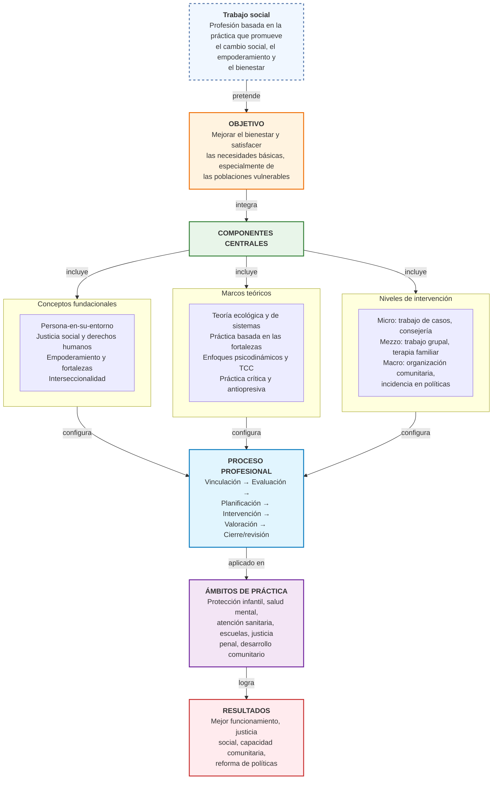

```mermaid
flowchart TD
    A[<b>Trabajo social</b><br>Profesión basada en la práctica que promueve<br>el cambio social, el empoderamiento y<br>el bienestar]:::title
    B[<b>OBJETIVO</b><br>Mejorar el bienestar y satisfacer<br>las necesidades básicas, especialmente de<br>las poblaciones vulnerables]:::goal
    C[<b>COMPONENTES CENTRALES</b>]:::core
    subgraph D[Conceptos fundacionales]
        D1[Persona-en-su-entorno<br>Justicia social y derechos humanos<br>Empoderamiento y fortalezas<br>Interseccionalidad]
    end
    subgraph E[Marcos teóricos]
        E1[Teoría ecológica y de sistemas<br>Práctica basada en las fortalezas<br>Enfoques psicodinámicos y TCC<br>Práctica crítica y antiopresiva]
    end
    subgraph F[Niveles de intervención]
        F1[Micro: trabajo de casos, consejería<br>Mezzo: trabajo grupal, terapia familiar<br>Macro: organización comunitaria,<br>incidencia en políticas]
    end
    G[<b>PROCESO PROFESIONAL</b><br>Vinculación → Evaluación →<br>Planificación → Intervención →<br>Valoración → Cierre/revisión]:::process
    H[<b>ÁMBITOS DE PRÁCTICA</b><br>Protección infantil, salud mental,<br>atención sanitaria, escuelas, justicia<br>penal, desarrollo comunitario]:::domains
    I[<b>RESULTADOS</b><br>Mejor funcionamiento, justicia<br>social, capacidad comunitaria,<br>reforma de políticas]:::outcome

    A -->|pretende| B
    B -->|integra| C
    C -->|incluye| D
    C -->|incluye| E
    C -->|incluye| F
    D & E & F -->|configura| G
    G -->|aplicado en| H
    H -->|logra| I

    classDef title fill:#f0f7ff,stroke:#4a6fa5,stroke-width:2px,color:#333,stroke-dasharray: 5 5
    classDef goal fill:#fff3e0,stroke:#ef6c00,stroke-width:2px,color:#333
    classDef core fill:#e8f5e9,stroke:#2e7d32,stroke-width:2px,color:#333
    classDef process fill:#e1f5fe,stroke:#0277bd,stroke-width:2px,color:#333
    classDef domains fill:#f3e5f5,stroke:#6a1b9a,stroke-width:2px,color:#333
    classDef outcome fill:#ffebee,stroke:#c62828,stroke-width:2px,color:#333
```
