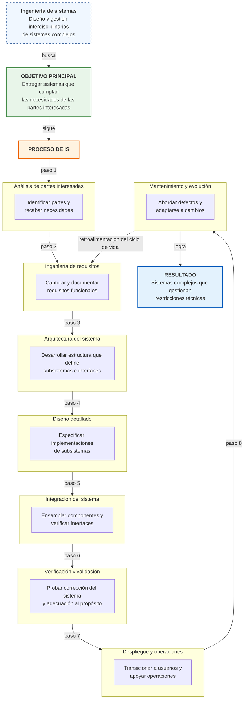

```mermaid
flowchart TD
    A[<b>Ingeniería de sistemas</b><br>Diseño y gestión interdisciplinarios<br>de sistemas complejos]:::title
    B[<b>OBJETIVO PRINCIPAL</b><br>Entregar sistemas que cumplan<br>las necesidades de las partes interesadas]:::goal
    C[<b>PROCESO DE IS</b>]:::process
    
    subgraph D[Análisis de partes interesadas]
        D1[Identificar partes y<br>recabar necesidades]
    end
    
    subgraph E[Ingeniería de requisitos]
        E1[Capturar y documentar<br>requisitos funcionales]
    end
    
    subgraph F[Arquitectura del sistema]
        F1[Desarrollar estructura que define<br>subsistemas e interfaces]
    end
    
    subgraph G[Diseño detallado]
        G1[Especificar implementaciones<br>de subsistemas]
    end
    
    subgraph H[Integración del sistema]
        H1[Ensamblar componentes y<br>verificar interfaces]
    end
    
    subgraph I[Verificación y validación]
        I1[Probar corrección del sistema<br>y adecuación al propósito]
    end
    
    subgraph J[Despliegue y operaciones]
        J1[Transicionar a usuarios y<br>apoyar operaciones]
    end
    
    subgraph K[Mantenimiento y evolución]
        K1[Abordar defectos y<br>adaptarse a cambios]
    end
    
    L[<b>RESULTADO</b><br>Sistemas complejos que gestionan<br>restricciones técnicas]:::outcome
    
    A -->|busca| B
    B -->|sigue| C
    C -->|paso 1| D
    D -->|paso 2| E
    E -->|paso 3| F
    F -->|paso 4| G
    G -->|paso 5| H
    H -->|paso 6| I
    I -->|paso 7| J
    J -->|paso 8| K
    K -->|logra| L
    K -.->|retroalimentación del ciclo de vida| E
    
    classDef title fill:#f0f7ff,stroke:#4a6fa5,stroke-width:2px,color:#333,stroke-dasharray:5 5
    classDef goal fill:#e8f5e9,stroke:#2e7d32,stroke-width:2px,color:#333
    classDef process fill:#fff3e0,stroke:#ef6c00,stroke-width:2px,color:#333
    classDef outcome fill:#e3f2fd,stroke:#1565c0,stroke-width:2px,color:#333
```
