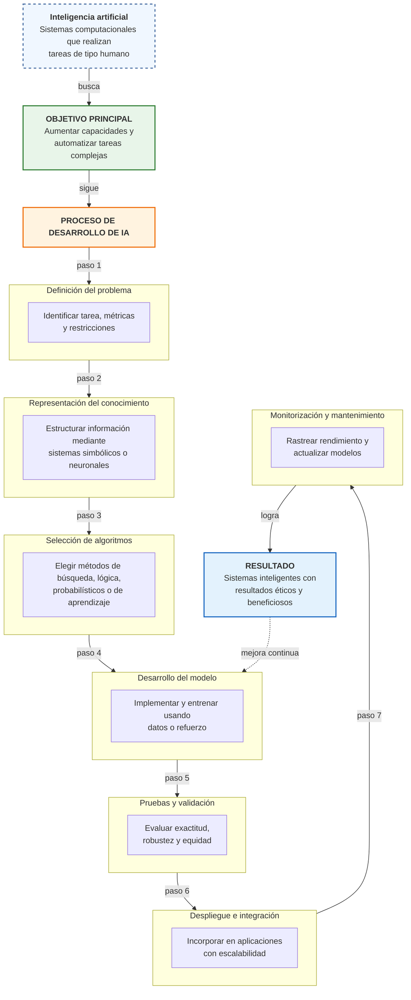

```mermaid
flowchart TD
    A[<b>Inteligencia artificial</b><br>Sistemas computacionales que realizan<br>tareas de tipo humano]:::title
    B[<b>OBJETIVO PRINCIPAL</b><br>Aumentar capacidades y<br>automatizar tareas complejas]:::goal
    C[<b>PROCESO DE DESARROLLO DE IA</b>]:::process
    
    subgraph D[Definición del problema]
        D1[Identificar tarea, métricas<br>y restricciones]
    end
    
    subgraph E[Representación del conocimiento]
        E1[Estructurar información mediante<br>sistemas simbólicos o neuronales]
    end
    
    subgraph F[Selección de algoritmos]
        F1[Elegir métodos de búsqueda, lógica,<br>probabilísticos o de aprendizaje]
    end
    
    subgraph G[Desarrollo del modelo]
        G1[Implementar y entrenar usando<br>datos o refuerzo]
    end
    
    subgraph H[Pruebas y validación]
        H1[Evaluar exactitud,<br>robustez y equidad]
    end
    
    subgraph I[Despliegue e integración]
        I1[Incorporar en aplicaciones<br>con escalabilidad]
    end
    
    subgraph J[Monitorización y mantenimiento]
        J1[Rastrear rendimiento y<br>actualizar modelos]
    end
    
    K[<b>RESULTADO</b><br>Sistemas inteligentes con<br>resultados éticos y beneficiosos]:::outcome
    
    A -->|busca| B
    B -->|sigue| C
    C -->|paso 1| D
    D -->|paso 2| E
    E -->|paso 3| F
    F -->|paso 4| G
    G -->|paso 5| H
    H -->|paso 6| I
    I -->|paso 7| J
    J -->|logra| K
    K -.->|mejora continua| G
    
    classDef title fill:#f0f7ff,stroke:#4a6fa5,stroke-width:2px,color:#333,stroke-dasharray:5 5
    classDef goal fill:#e8f5e9,stroke:#2e7d32,stroke-width:2px,color:#333
    classDef process fill:#fff3e0,stroke:#ef6c00,stroke-width:2px,color:#333
    classDef outcome fill:#e3f2fd,stroke:#1565c0,stroke-width:2px,color:#333
```
