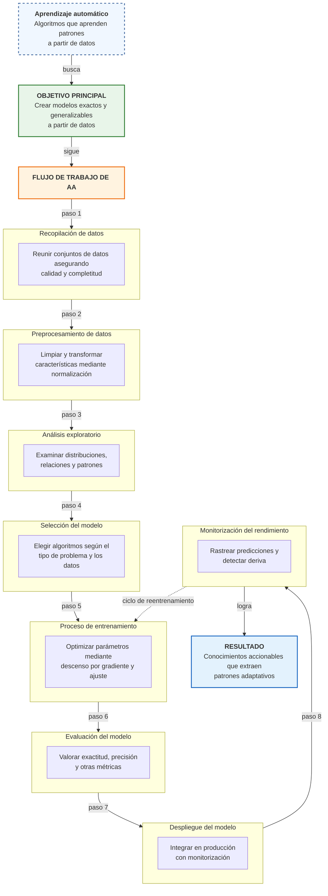

```mermaid
flowchart TD
    A[<b>Aprendizaje automático</b><br>Algoritmos que aprenden patrones<br>a partir de datos]:::title
    B[<b>OBJETIVO PRINCIPAL</b><br>Crear modelos exactos y generalizables<br>a partir de datos]:::goal
    C[<b>FLUJO DE TRABAJO DE AA</b>]:::process
    
    subgraph D[Recopilación de datos]
        D1[Reunir conjuntos de datos asegurando<br>calidad y completitud]
    end
    
    subgraph E[Preprocesamiento de datos]
        E1[Limpiar y transformar<br>características mediante normalización]
    end
    
    subgraph F[Análisis exploratorio]
        F1[Examinar distribuciones,<br>relaciones y patrones]
    end
    
    subgraph G[Selección del modelo]
        G1[Elegir algoritmos según el<br>tipo de problema y los datos]
    end
    
    subgraph H[Proceso de entrenamiento]
        H1[Optimizar parámetros mediante<br>descenso por gradiente y ajuste]
    end
    
    subgraph I[Evaluación del modelo]
        I1[Valorar exactitud, precisión<br>y otras métricas]
    end
    
    subgraph J[Despliegue del modelo]
        J1[Integrar en producción<br>con monitorización]
    end
    
    subgraph K[Monitorización del rendimiento]
        K1[Rastrear predicciones y<br>detectar deriva]
    end
    
    L[<b>RESULTADO</b><br>Conocimientos accionables que extraen<br>patrones adaptativos]:::outcome
    
    A -->|busca| B
    B -->|sigue| C
    C -->|paso 1| D
    D -->|paso 2| E
    E -->|paso 3| F
    F -->|paso 4| G
    G -->|paso 5| H
    H -->|paso 6| I
    I -->|paso 7| J
    J -->|paso 8| K
    K -->|logra| L
    K -.->|ciclo de reentrenamiento| H
    
    classDef title fill:#f0f7ff,stroke:#4a6fa5,stroke-width:2px,color:#333,stroke-dasharray:5 5
    classDef goal fill:#e8f5e9,stroke:#2e7d32,stroke-width:2px,color:#333
    classDef process fill:#fff3e0,stroke:#ef6c00,stroke-width:2px,color:#333
    classDef outcome fill:#e3f2fd,stroke:#1565c0,stroke-width:2px,color:#333
```
