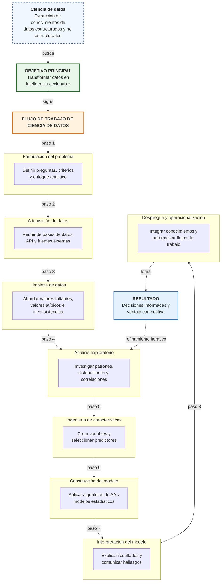

```mermaid
flowchart TD
    A[<b>Ciencia de datos</b><br>Extracción de conocimientos de<br>datos estructurados y no estructurados]:::title
    B[<b>OBJETIVO PRINCIPAL</b><br>Transformar datos en<br>inteligencia accionable]:::goal
    C[<b>FLUJO DE TRABAJO DE CIENCIA DE DATOS</b>]:::process
    
    subgraph D[Formulación del problema]
        D1[Definir preguntas, criterios<br>y enfoque analítico]
    end
    
    subgraph E[Adquisición de datos]
        E1[Reunir de bases de datos,<br>API y fuentes externas]
    end
    
    subgraph F[Limpieza de datos]
        F1[Abordar valores faltantes,<br>valores atípicos e inconsistencias]
    end
    
    subgraph G[Análisis exploratorio]
        G1[Investigar patrones,<br>distribuciones y correlaciones]
    end
    
    subgraph H[Ingeniería de características]
        H1[Crear variables y<br>seleccionar predictores]
    end
    
    subgraph I[Construcción del modelo]
        I1[Aplicar algoritmos de AA y<br>modelos estadísticos]
    end
    
    subgraph J[Interpretación del modelo]
        J1[Explicar resultados y<br>comunicar hallazgos]
    end
    
    subgraph K[Despliegue y operacionalización]
        K1[Integrar conocimientos y<br>automatizar flujos de trabajo]
    end
    
    L[<b>RESULTADO</b><br>Decisiones informadas y<br>ventaja competitiva]:::outcome
    
    A -->|busca| B
    B -->|sigue| C
    C -->|paso 1| D
    D -->|paso 2| E
    E -->|paso 3| F
    F -->|paso 4| G
    G -->|paso 5| H
    H -->|paso 6| I
    I -->|paso 7| J
    J -->|paso 8| K
    K -->|logra| L
    L -.->|refinamiento iterativo| G
    
    classDef title fill:#f0f7ff,stroke:#4a6fa5,stroke-width:2px,color:#333,stroke-dasharray:5 5
    classDef goal fill:#e8f5e9,stroke:#2e7d32,stroke-width:2px,color:#333
    classDef process fill:#fff3e0,stroke:#ef6c00,stroke-width:2px,color:#333
    classDef outcome fill:#e3f2fd,stroke:#1565c0,stroke-width:2px,color:#333
```
