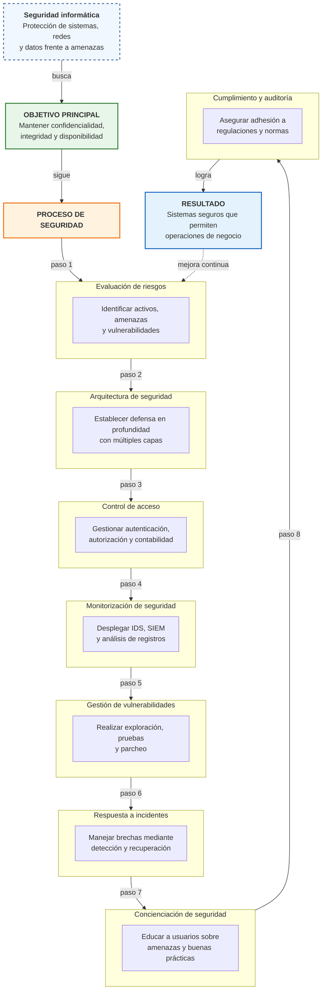

```mermaid
flowchart TD
    A[<b>Seguridad informática</b><br>Protección de sistemas, redes<br>y datos frente a amenazas]:::title
    B[<b>OBJETIVO PRINCIPAL</b><br>Mantener confidencialidad,<br>integridad y disponibilidad]:::goal
    C[<b>PROCESO DE SEGURIDAD</b>]:::process
    
    subgraph D[Evaluación de riesgos]
        D1[Identificar activos, amenazas<br>y vulnerabilidades]
    end
    
    subgraph E[Arquitectura de seguridad]
        E1[Establecer defensa en profundidad<br>con múltiples capas]
    end
    
    subgraph F[Control de acceso]
        F1[Gestionar autenticación,<br>autorización y contabilidad]
    end
    
    subgraph G[Monitorización de seguridad]
        G1[Desplegar IDS, SIEM<br>y análisis de registros]
    end
    
    subgraph H[Gestión de vulnerabilidades]
        H1[Realizar exploración, pruebas<br>y parcheo]
    end
    
    subgraph I[Respuesta a incidentes]
        I1[Manejar brechas mediante<br>detección y recuperación]
    end
    
    subgraph J[Concienciación de seguridad]
        J1[Educar a usuarios sobre<br>amenazas y buenas prácticas]
    end
    
    subgraph K[Cumplimiento y auditoría]
        K1[Asegurar adhesión a<br>regulaciones y normas]
    end
    
    L[<b>RESULTADO</b><br>Sistemas seguros que permiten<br>operaciones de negocio]:::outcome
    
    A -->|busca| B
    B -->|sigue| C
    C -->|paso 1| D
    D -->|paso 2| E
    E -->|paso 3| F
    F -->|paso 4| G
    G -->|paso 5| H
    H -->|paso 6| I
    I -->|paso 7| J
    J -->|paso 8| K
    K -->|logra| L
    L -.->|mejora continua| D
    
    classDef title fill:#f0f7ff,stroke:#4a6fa5,stroke-width:2px,color:#333,stroke-dasharray:5 5
    classDef goal fill:#e8f5e9,stroke:#2e7d32,stroke-width:2px,color:#333
    classDef process fill:#fff3e0,stroke:#ef6c00,stroke-width:2px,color:#333
    classDef outcome fill:#e3f2fd,stroke:#1565c0,stroke-width:2px,color:#333
```
