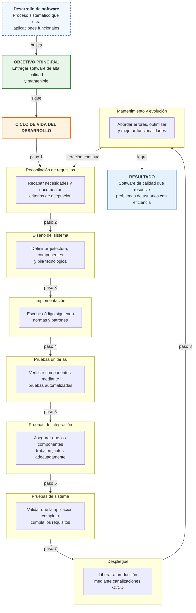

```mermaid
flowchart TD
    A[<b>Desarrollo de software</b><br>Proceso sistemático que crea<br>aplicaciones funcionales]:::title
    B[<b>OBJETIVO PRINCIPAL</b><br>Entregar software de alta calidad<br>y mantenible]:::goal
    C[<b>CICLO DE VIDA DEL DESARROLLO</b>]:::process
    
    subgraph D[Recopilación de requisitos]
        D1[Recabar necesidades y documentar<br>criterios de aceptación]
    end
    
    subgraph E[Diseño del sistema]
        E1[Definir arquitectura, componentes<br>y pila tecnológica]
    end
    
    subgraph F[Implementación]
        F1[Escribir código siguiendo<br>normas y patrones]
    end
    
    subgraph G[Pruebas unitarias]
        G1[Verificar componentes mediante<br>pruebas automatizadas]
    end
    
    subgraph H[Pruebas de integración]
        H1[Asegurar que los componentes<br>trabajen juntos adecuadamente]
    end
    
    subgraph I[Pruebas de sistema]
        I1[Validar que la aplicación completa<br>cumpla los requisitos]
    end
    
    subgraph J[Despliegue]
        J1[Liberar a producción<br>mediante canalizaciones CI/CD]
    end
    
    subgraph K[Mantenimiento y evolución]
        K1[Abordar errores, optimizar<br>y mejorar funcionalidades]
    end
    
    L[<b>RESULTADO</b><br>Software de calidad que resuelve<br>problemas de usuarios con eficiencia]:::outcome
    
    A -->|busca| B
    B -->|sigue| C
    C -->|paso 1| D
    D -->|paso 2| E
    E -->|paso 3| F
    F -->|paso 4| G
    G -->|paso 5| H
    H -->|paso 6| I
    I -->|paso 7| J
    J -->|paso 8| K
    K -->|logra| L
    K -.->|iteración continua| D
    
    classDef title fill:#f0f7ff,stroke:#4a6fa5,stroke-width:2px,color:#333,stroke-dasharray:5 5
    classDef goal fill:#e8f5e9,stroke:#2e7d32,stroke-width:2px,color:#333
    classDef process fill:#fff3e0,stroke:#ef6c00,stroke-width:2px,color:#333
    classDef outcome fill:#e3f2fd,stroke:#1565c0,stroke-width:2px,color:#333
```
