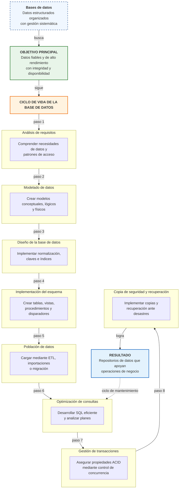

```mermaid
flowchart TD
    A[<b>Bases de datos</b><br>Datos estructurados organizados<br>con gestión sistemática]:::title
    B[<b>OBJETIVO PRINCIPAL</b><br>Datos fiables y de alto rendimiento<br>con integridad y disponibilidad]:::goal
    C[<b>CICLO DE VIDA DE LA BASE DE DATOS</b>]:::process
    
    subgraph D[Análisis de requisitos]
        D1[Comprender necesidades de datos y<br>patrones de acceso]
    end
    
    subgraph E[Modelado de datos]
        E1[Crear modelos conceptuales, lógicos<br>y físicos]
    end
    
    subgraph F[Diseño de la base de datos]
        F1[Implementar normalización,<br>claves e índices]
    end
    
    subgraph G[Implementación del esquema]
        G1[Crear tablas, vistas,<br>procedimientos y disparadores]
    end
    
    subgraph H[Población de datos]
        H1[Cargar mediante ETL, importaciones<br>o migración]
    end
    
    subgraph I[Optimización de consultas]
        I1[Desarrollar SQL eficiente<br>y analizar planes]
    end
    
    subgraph J[Gestión de transacciones]
        J1[Asegurar propiedades ACID<br>mediante control de concurrencia]
    end
    
    subgraph K[Copia de seguridad y recuperación]
        K1[Implementar copias y<br>recuperación ante desastres]
    end
    
    L[<b>RESULTADO</b><br>Repositorios de datos que apoyan<br>operaciones de negocio]:::outcome
    
    A -->|busca| B
    B -->|sigue| C
    C -->|paso 1| D
    D -->|paso 2| E
    E -->|paso 3| F
    F -->|paso 4| G
    G -->|paso 5| H
    H -->|paso 6| I
    I -->|paso 7| J
    J -->|paso 8| K
    K -->|logra| L
    L -.->|ciclo de mantenimiento| I
    
    classDef title fill:#f0f7ff,stroke:#4a6fa5,stroke-width:2px,color:#333,stroke-dasharray:5 5
    classDef goal fill:#e8f5e9,stroke:#2e7d32,stroke-width:2px,color:#333
    classDef process fill:#fff3e0,stroke:#ef6c00,stroke-width:2px,color:#333
    classDef outcome fill:#e3f2fd,stroke:#1565c0,stroke-width:2px,color:#333
```
