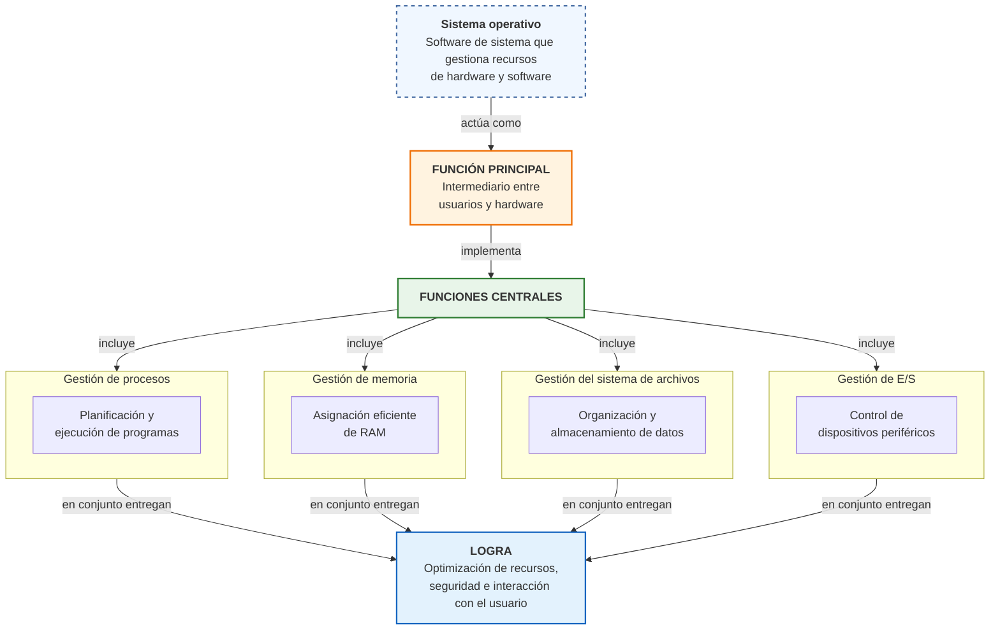

```mermaid
flowchart TD
    A[<b>Sistema operativo</b><br>Software de sistema que gestiona recursos<br>de hardware y software]:::title
    B[<b>FUNCIÓN PRINCIPAL</b><br>Intermediario entre<br>usuarios y hardware]:::role
    C[<b>FUNCIONES CENTRALES</b>]:::functions
    
    subgraph D[Gestión de procesos]
        D1[Planificación y<br>ejecución de programas]
    end
    
    subgraph E[Gestión de memoria]
        E1[Asignación eficiente<br>de RAM]
    end
    
    subgraph F[Gestión del sistema de archivos]
        F1[Organización y<br>almacenamiento de datos]
    end
    
    subgraph G[Gestión de E/S]
        G1[Control de<br>dispositivos periféricos]
    end
    
    H[<b>LOGRA</b><br>Optimización de recursos,<br>seguridad e interacción con el usuario]:::goal
    
    A -->|actúa como| B
    B -->|implementa| C
    C -->|incluye| D
    C -->|incluye| E
    C -->|incluye| F
    C -->|incluye| G
    D & E & F & G -->|en conjunto entregan| H
    
    classDef title fill:#f0f7ff,stroke:#4a6fa5,stroke-width:2px,color:#333,stroke-dasharray: 5 5
    classDef role fill:#fff3e0,stroke:#ef6c00,stroke-width:2px,color:#333
    classDef functions fill:#e8f5e9,stroke:#2e7d32,stroke-width:2px,color:#333
    classDef goal fill:#e3f2fd,stroke:#1565c0,stroke-width:2px,color:#333
```
