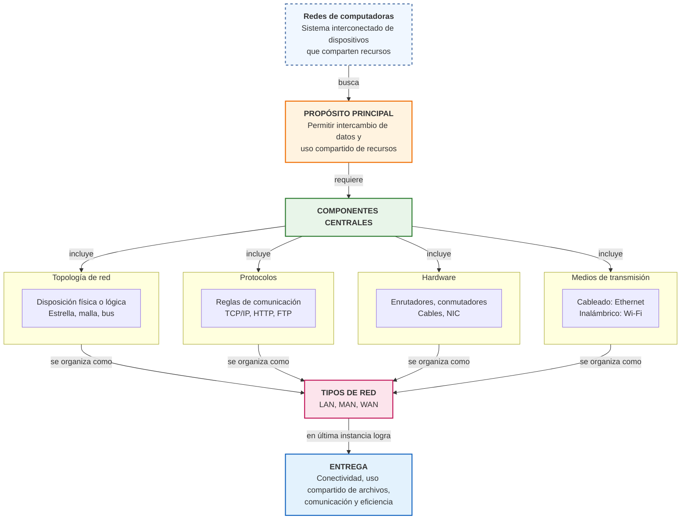

```mermaid
flowchart TD
    A[<b>Redes de computadoras</b><br>Sistema interconectado de dispositivos<br>que comparten recursos]:::title
    B[<b>PROPÓSITO PRINCIPAL</b><br>Permitir intercambio de datos y<br>uso compartido de recursos]:::purpose
    C[<b>COMPONENTES CENTRALES</b>]:::components
    
    subgraph D[Topología de red]
        D1[Disposición física o lógica<br>Estrella, malla, bus]
    end
    
    subgraph E[Protocolos]
        E1[Reglas de comunicación<br>TCP/IP, HTTP, FTP]
    end
    
    subgraph F[Hardware]
        F1[Enrutadores, conmutadores<br>Cables, NIC]
    end
    
    subgraph G[Medios de transmisión]
        G1[Cableado: Ethernet<br>Inalámbrico: Wi-Fi]
    end
    
    H[<b>TIPOS DE RED</b><br>LAN, MAN, WAN]:::types
    I[<b>ENTREGA</b><br>Conectividad, uso compartido de archivos,<br>comunicación y eficiencia]:::goal
    
    A -->|busca| B
    B -->|requiere| C
    C -->|incluye| D
    C -->|incluye| E
    C -->|incluye| F
    C -->|incluye| G
    D & E & F & G -->|se organiza como| H
    H -->|en última instancia logra| I
    
    classDef title fill:#f0f7ff,stroke:#4a6fa5,stroke-width:2px,color:#333,stroke-dasharray: 5 5
    classDef purpose fill:#fff3e0,stroke:#ef6c00,stroke-width:2px,color:#333
    classDef components fill:#e8f5e9,stroke:#2e7d32,stroke-width:2px,color:#333
    classDef types fill:#fce4ec,stroke:#c2185b,stroke-width:2px,color:#333
    classDef goal fill:#e3f2fd,stroke:#1565c0,stroke-width:2px,color:#333
```
