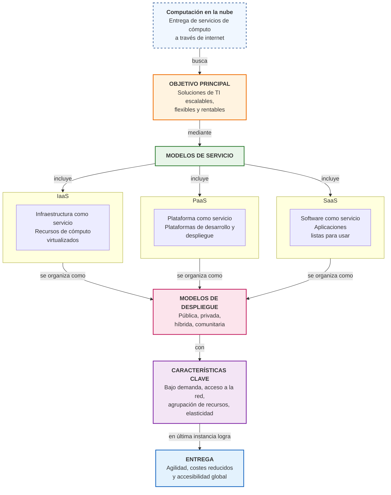

```mermaid
flowchart TD
    A[<b>Computación en la nube</b><br>Entrega de servicios de cómputo<br>a través de internet]:::title
    B[<b>OBJETIVO PRINCIPAL</b><br>Soluciones de TI escalables,<br>flexibles y rentables]:::goal
    C[<b>MODELOS DE SERVICIO</b>]:::models
    
    subgraph D[IaaS]
        D1[Infraestructura como servicio<br>Recursos de cómputo<br>virtualizados]
    end
    
    subgraph E[PaaS]
        E1[Plataforma como servicio<br>Plataformas de desarrollo y<br>despliegue]
    end
    
    subgraph F[SaaS]
        F1[Software como servicio<br>Aplicaciones<br>listas para usar]
    end
    
    G[<b>MODELOS DE DESPLIEGUE</b><br>Pública, privada,<br>híbrida, comunitaria]:::deployment
    
    H[<b>CARACTERÍSTICAS CLAVE</b><br>Bajo demanda, acceso a la red,<br>agrupación de recursos, elasticidad]:::characteristics
    
    I[<b>ENTREGA</b><br>Agilidad, costes reducidos<br>y accesibilidad global]:::outcome
    
    A -->|busca| B
    B -->|mediante| C
    C -->|incluye| D
    C -->|incluye| E
    C -->|incluye| F
    D & E & F -->|se organiza como| G
    G -->|con| H
    H -->|en última instancia logra| I
    
    classDef title fill:#f0f7ff,stroke:#4a6fa5,stroke-width:2px,color:#333,stroke-dasharray: 5 5
    classDef goal fill:#fff3e0,stroke:#ef6c00,stroke-width:2px,color:#333
    classDef models fill:#e8f5e9,stroke:#2e7d32,stroke-width:2px,color:#333
    classDef deployment fill:#fce4ec,stroke:#c2185b,stroke-width:2px,color:#333
    classDef characteristics fill:#f3e5f5,stroke:#7b1fa2,stroke-width:2px,color:#333
    classDef outcome fill:#e3f2fd,stroke:#1565c0,stroke-width:2px,color:#333
```
