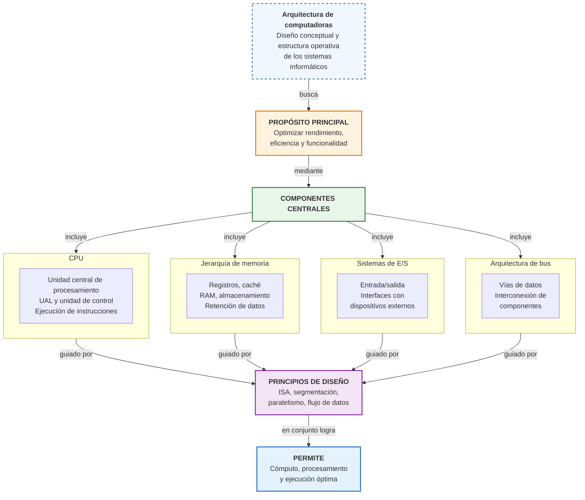

```mermaid
flowchart TD
    A[<b>Arquitectura de computadoras</b><br>Diseño conceptual y estructura operativa<br>de los sistemas informáticos]:::title
    B[<b>PROPÓSITO PRINCIPAL</b><br>Optimizar rendimiento,<br>eficiencia y funcionalidad]:::purpose
    C[<b>COMPONENTES CENTRALES</b>]:::components
    
    subgraph D[CPU]
        D1[Unidad central de procesamiento<br>UAL y unidad de control<br>Ejecución de instrucciones]
    end
    
    subgraph E[Jerarquía de memoria]
        E1[Registros, caché<br>RAM, almacenamiento<br>Retención de datos]
    end
    
    subgraph F[Sistemas de E/S]
        F1[Entrada/salida<br>Interfaces con<br>dispositivos externos]
    end
    
    subgraph G[Arquitectura de bus]
        G1[Vías de datos<br>Interconexión de<br>componentes]
    end
    
    H[<b>PRINCIPIOS DE DISEÑO</b><br>ISA, segmentación,<br>paralelismo, flujo de datos]:::principles
    
    I[<b>PERMITE</b><br>Cómputo, procesamiento<br>y ejecución óptima]:::outcome
    
    A -->|busca| B
    B -->|mediante| C
    C -->|incluye| D
    C -->|incluye| E
    C -->|incluye| F
    C -->|incluye| G
    D & E & F & G -->|guiado por| H
    H -->|en conjunto logra| I
    
    classDef title fill:#f0f7ff,stroke:#4a6fa5,stroke-width:2px,color:#333,stroke-dasharray: 5 5
    classDef purpose fill:#fff3e0,stroke:#ef6c00,stroke-width:2px,color:#333
    classDef components fill:#e8f5e9,stroke:#2e7d32,stroke-width:2px,color:#333
    classDef principles fill:#f3e5f5,stroke:#7b1fa2,stroke-width:2px,color:#333
    classDef outcome fill:#e3f2fd,stroke:#1565c0,stroke-width:2px,color:#333
```
