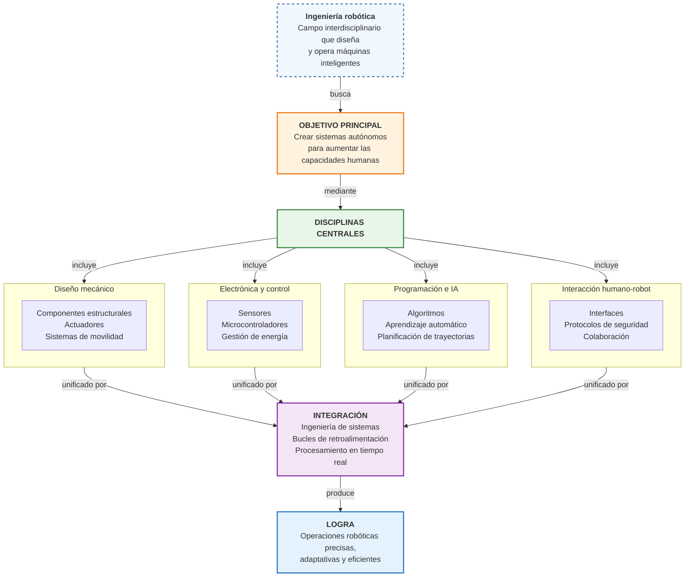

```mermaid
flowchart TD
    A[<b>Ingeniería robótica</b><br>Campo interdisciplinario que diseña<br>y opera máquinas inteligentes]:::title
    B[<b>OBJETIVO PRINCIPAL</b><br>Crear sistemas autónomos<br>para aumentar las capacidades humanas]:::goal
    C[<b>DISCIPLINAS CENTRALES</b>]:::disciplines
    
    subgraph D[Diseño mecánico]
        D1[Componentes estructurales<br>Actuadores<br>Sistemas de movilidad]
    end
    
    subgraph E[Electrónica y control]
        E1[Sensores<br>Microcontroladores<br>Gestión de energía]
    end
    
    subgraph F[Programación e IA]
        F1[Algoritmos<br>Aprendizaje automático<br>Planificación de trayectorias]
    end
    
    subgraph G[Interacción humano-robot]
        G1[Interfaces<br>Protocolos de seguridad<br>Colaboración]
    end
    
    H[<b>INTEGRACIÓN</b><br>Ingeniería de sistemas<br>Bucles de retroalimentación<br>Procesamiento en tiempo real]:::integration
    
    I[<b>LOGRA</b><br>Operaciones robóticas precisas,<br>adaptativas y eficientes]:::outcome
    
    A -->|busca| B
    B -->|mediante| C
    C -->|incluye| D
    C -->|incluye| E
    C -->|incluye| F
    C -->|incluye| G
    D & E & F & G -->|unificado por| H
    H -->|produce| I
    
    classDef title fill:#f0f7ff,stroke:#4a6fa5,stroke-width:2px,color:#333,stroke-dasharray: 5 5
    classDef goal fill:#fff3e0,stroke:#ef6c00,stroke-width:2px,color:#333
    classDef disciplines fill:#e8f5e9,stroke:#2e7d32,stroke-width:2px,color:#333
    classDef integration fill:#f3e5f5,stroke:#7b1fa2,stroke-width:2px,color:#333
    classDef outcome fill:#e3f2fd,stroke:#1565c0,stroke-width:2px,color:#333
```
