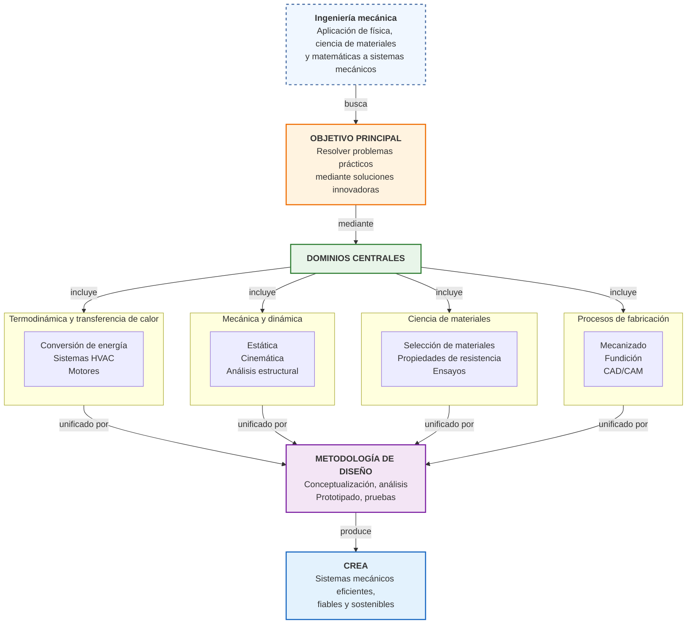

```mermaid
flowchart TD
    A[<b>Ingeniería mecánica</b><br>Aplicación de física, ciencia de materiales<br>y matemáticas a sistemas mecánicos]:::title
    B[<b>OBJETIVO PRINCIPAL</b><br>Resolver problemas prácticos<br>mediante soluciones innovadoras]:::objective
    C[<b>DOMINIOS CENTRALES</b>]:::domains
    
    subgraph D[Termodinámica y transferencia de calor]
        D1[Conversión de energía<br>Sistemas HVAC<br>Motores]
    end
    
    subgraph E[Mecánica y dinámica]
        E1[Estática<br>Cinemática<br>Análisis estructural]
    end
    
    subgraph F[Ciencia de materiales]
        F1[Selección de materiales<br>Propiedades de resistencia<br>Ensayos]
    end
    
    subgraph G[Procesos de fabricación]
        G1[Mecanizado<br>Fundición<br>CAD/CAM]
    end
    
    H[<b>METODOLOGÍA DE DISEÑO</b><br>Conceptualización, análisis<br>Prototipado, pruebas]:::methodology
    
    I[<b>CREA</b><br>Sistemas mecánicos eficientes,<br>fiables y sostenibles]:::outcome
    
    A -->|busca| B
    B -->|mediante| C
    C -->|incluye| D
    C -->|incluye| E
    C -->|incluye| F
    C -->|incluye| G
    D & E & F & G -->|unificado por| H
    H -->|produce| I
    
    classDef title fill:#f0f7ff,stroke:#4a6fa5,stroke-width:2px,color:#333,stroke-dasharray: 5 5
    classDef objective fill:#fff3e0,stroke:#ef6c00,stroke-width:2px,color:#333
    classDef domains fill:#e8f5e9,stroke:#2e7d32,stroke-width:2px,color:#333
    classDef methodology fill:#f3e5f5,stroke:#7b1fa2,stroke-width:2px,color:#333
    classDef outcome fill:#e3f2fd,stroke:#1565c0,stroke-width:2px,color:#333
```
