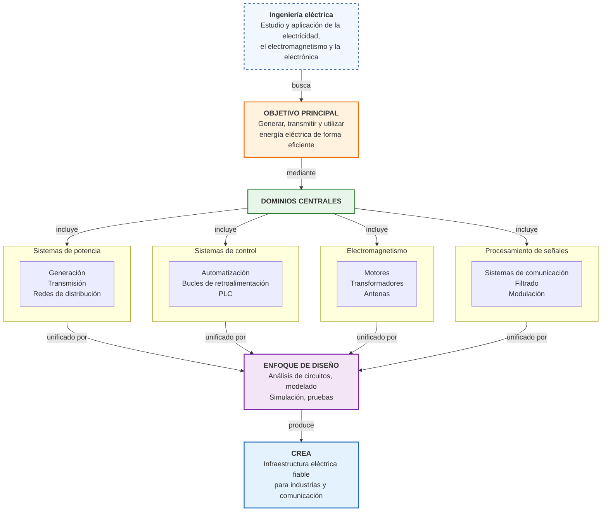

```mermaid
flowchart TD
    A[<b>Ingeniería eléctrica</b><br>Estudio y aplicación de la electricidad,<br>el electromagnetismo y la electrónica]:::title
    B[<b>OBJETIVO PRINCIPAL</b><br>Generar, transmitir y utilizar<br>energía eléctrica de forma eficiente]:::objective
    C[<b>DOMINIOS CENTRALES</b>]:::domains
    
    subgraph D[Sistemas de potencia]
        D1[Generación<br>Transmisión<br>Redes de distribución]
    end
    
    subgraph E[Sistemas de control]
        E1[Automatización<br>Bucles de retroalimentación<br>PLC]
    end
    
    subgraph F[Electromagnetismo]
        F1[Motores<br>Transformadores<br>Antenas]
    end
    
    subgraph G[Procesamiento de señales]
        G1[Sistemas de comunicación<br>Filtrado<br>Modulación]
    end
    
    H[<b>ENFOQUE DE DISEÑO</b><br>Análisis de circuitos, modelado<br>Simulación, pruebas]:::approach
    
    I[<b>CREA</b><br>Infraestructura eléctrica fiable<br>para industrias y comunicación]:::outcome
    
    A -->|busca| B
    B -->|mediante| C
    C -->|incluye| D
    C -->|incluye| E
    C -->|incluye| F
    C -->|incluye| G
    D & E & F & G -->|unificado por| H
    H -->|produce| I
    
    classDef title fill:#f0f7ff,stroke:#4a6fa5,stroke-width:2px,color:#333,stroke-dasharray: 5 5
    classDef objective fill:#fff3e0,stroke:#ef6c00,stroke-width:2px,color:#333
    classDef domains fill:#e8f5e9,stroke:#2e7d32,stroke-width:2px,color:#333
    classDef approach fill:#f3e5f5,stroke:#7b1fa2,stroke-width:2px,color:#333
    classDef outcome fill:#e3f2fd,stroke:#1565c0,stroke-width:2px,color:#333
```
