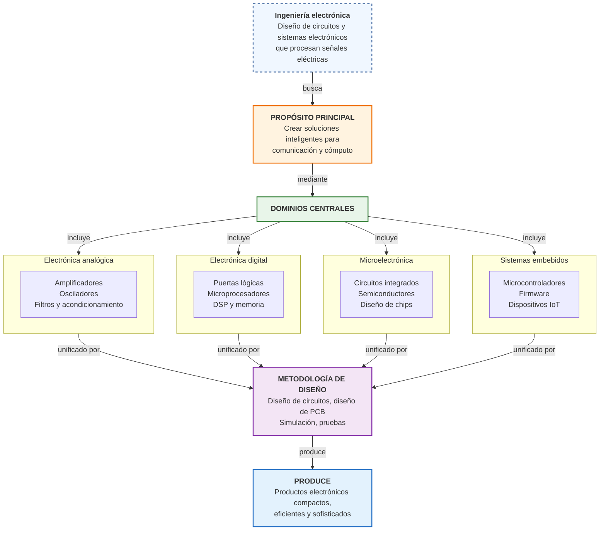

```mermaid
flowchart TD
    A[<b>Ingeniería electrónica</b><br>Diseño de circuitos y sistemas electrónicos<br>que procesan señales eléctricas]:::title
    B[<b>PROPÓSITO PRINCIPAL</b><br>Crear soluciones inteligentes para<br>comunicación y cómputo]:::purpose
    C[<b>DOMINIOS CENTRALES</b>]:::domains
    
    subgraph D[Electrónica analógica]
        D1[Amplificadores<br>Osciladores<br>Filtros y acondicionamiento]
    end
    
    subgraph E[Electrónica digital]
        E1[Puertas lógicas<br>Microprocesadores<br>DSP y memoria]
    end
    
    subgraph F[Microelectrónica]
        F1[Circuitos integrados<br>Semiconductores<br>Diseño de chips]
    end
    
    subgraph G[Sistemas embebidos]
        G1[Microcontroladores<br>Firmware<br>Dispositivos IoT]
    end
    
    H[<b>METODOLOGÍA DE DISEÑO</b><br>Diseño de circuitos, diseño de PCB<br>Simulación, pruebas]:::methodology
    
    I[<b>PRODUCE</b><br>Productos electrónicos compactos,<br>eficientes y sofisticados]:::outcome
    
    A -->|busca| B
    B -->|mediante| C
    C -->|incluye| D
    C -->|incluye| E
    C -->|incluye| F
    C -->|incluye| G
    D & E & F & G -->|unificado por| H
    H -->|produce| I
    
    classDef title fill:#f0f7ff,stroke:#4a6fa5,stroke-width:2px,color:#333,stroke-dasharray: 5 5
    classDef purpose fill:#fff3e0,stroke:#ef6c00,stroke-width:2px,color:#333
    classDef domains fill:#e8f5e9,stroke:#2e7d32,stroke-width:2px,color:#333
    classDef methodology fill:#f3e5f5,stroke:#7b1fa2,stroke-width:2px,color:#333
    classDef outcome fill:#e3f2fd,stroke:#1565c0,stroke-width:2px,color:#333
```
