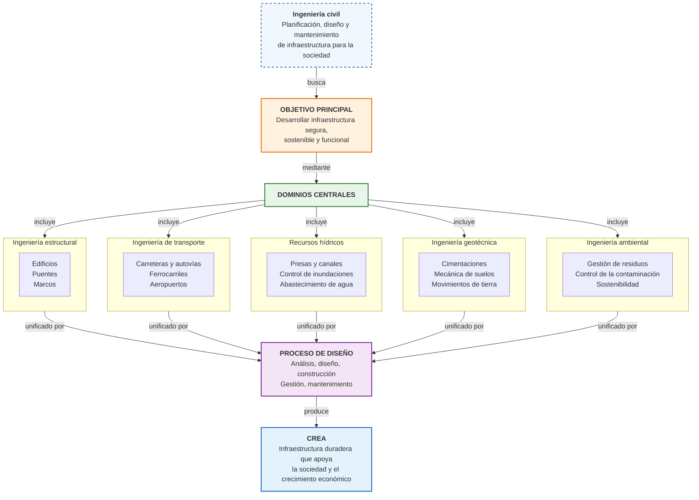

```mermaid
flowchart TD
    A[<b>Ingeniería civil</b><br>Planificación, diseño y mantenimiento<br>de infraestructura para la sociedad]:::title
    B[<b>OBJETIVO PRINCIPAL</b><br>Desarrollar infraestructura segura,<br>sostenible y funcional]:::objective
    C[<b>DOMINIOS CENTRALES</b>]:::domains
    
    subgraph D[Ingeniería estructural]
        D1[Edificios<br>Puentes<br>Marcos]
    end
    
    subgraph E[Ingeniería de transporte]
        E1[Carreteras y autovías<br>Ferrocarriles<br>Aeropuertos]
    end
    
    subgraph F[Recursos hídricos]
        F1[Presas y canales<br>Control de inundaciones<br>Abastecimiento de agua]
    end
    
    subgraph G[Ingeniería geotécnica]
        G1[Cimentaciones<br>Mecánica de suelos<br>Movimientos de tierra]
    end
    
    subgraph H[Ingeniería ambiental]
        H1[Gestión de residuos<br>Control de la contaminación<br>Sostenibilidad]
    end
    
    I[<b>PROCESO DE DISEÑO</b><br>Análisis, diseño, construcción<br>Gestión, mantenimiento]:::process
    
    J[<b>CREA</b><br>Infraestructura duradera que apoya<br>la sociedad y el crecimiento económico]:::outcome
    
    A -->|busca| B
    B -->|mediante| C
    C -->|incluye| D
    C -->|incluye| E
    C -->|incluye| F
    C -->|incluye| G
    C -->|incluye| H
    D & E & F & G & H -->|unificado por| I
    I -->|produce| J
    
    classDef title fill:#f0f7ff,stroke:#4a6fa5,stroke-width:2px,color:#333,stroke-dasharray: 5 5
    classDef objective fill:#fff3e0,stroke:#ef6c00,stroke-width:2px,color:#333
    classDef domains fill:#e8f5e9,stroke:#2e7d32,stroke-width:2px,color:#333
    classDef process fill:#f3e5f5,stroke:#7b1fa2,stroke-width:2px,color:#333
    classDef outcome fill:#e3f2fd,stroke:#1565c0,stroke-width:2px,color:#333
```
