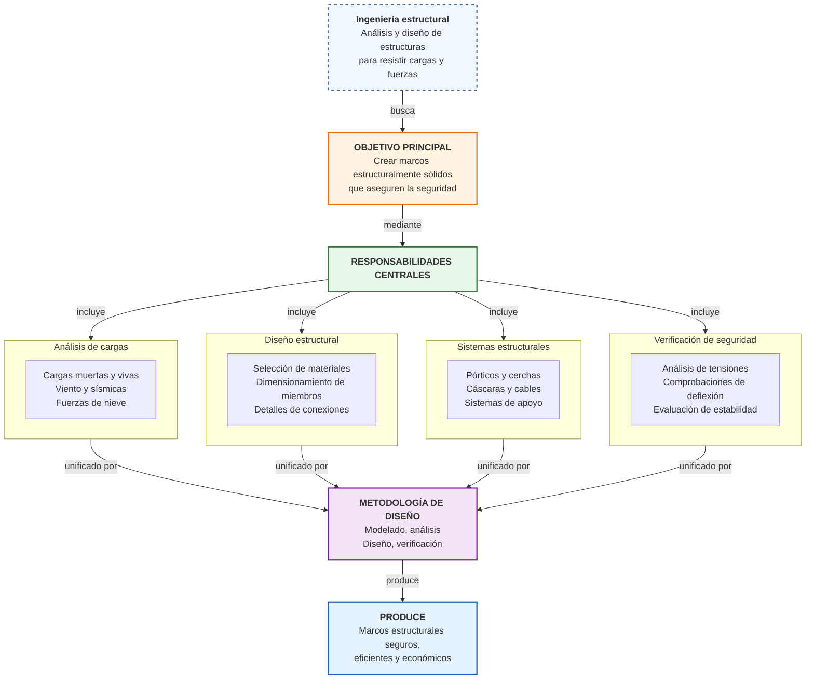

```mermaid
flowchart TD
    A[<b>Ingeniería estructural</b><br>Análisis y diseño de estructuras<br>para resistir cargas y fuerzas]:::title
    B[<b>OBJETIVO PRINCIPAL</b><br>Crear marcos estructuralmente sólidos<br>que aseguren la seguridad]:::goal
    C[<b>RESPONSABILIDADES CENTRALES</b>]:::responsibilities
    
    subgraph D[Análisis de cargas]
        D1[Cargas muertas y vivas<br>Viento y sísmicas<br>Fuerzas de nieve]
    end
    
    subgraph E[Diseño estructural]
        E1[Selección de materiales<br>Dimensionamiento de miembros<br>Detalles de conexiones]
    end
    
    subgraph F[Sistemas estructurales]
        F1[Pórticos y cerchas<br>Cáscaras y cables<br>Sistemas de apoyo]
    end
    
    subgraph G[Verificación de seguridad]
        G1[Análisis de tensiones<br>Comprobaciones de deflexión<br>Evaluación de estabilidad]
    end
    
    H[<b>METODOLOGÍA DE DISEÑO</b><br>Modelado, análisis<br>Diseño, verificación]:::methodology
    
    I[<b>PRODUCE</b><br>Marcos estructurales seguros,<br>eficientes y económicos]:::outcome
    
    A -->|busca| B
    B -->|mediante| C
    C -->|incluye| D
    C -->|incluye| E
    C -->|incluye| F
    C -->|incluye| G
    D & E & F & G -->|unificado por| H
    H -->|produce| I
    
    classDef title fill:#f0f7ff,stroke:#4a6fa5,stroke-width:2px,color:#333,stroke-dasharray: 5 5
    classDef goal fill:#fff3e0,stroke:#ef6c00,stroke-width:2px,color:#333
    classDef responsibilities fill:#e8f5e9,stroke:#2e7d32,stroke-width:2px,color:#333
    classDef methodology fill:#f3e5f5,stroke:#7b1fa2,stroke-width:2px,color:#333
    classDef outcome fill:#e3f2fd,stroke:#1565c0,stroke-width:2px,color:#333
```
