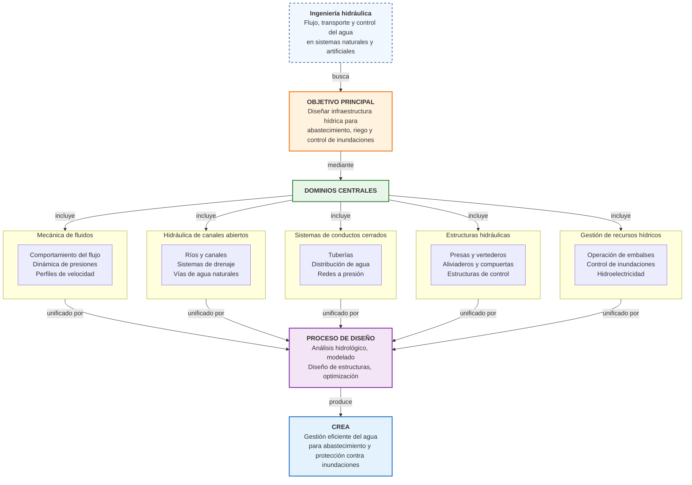

```mermaid
flowchart TD
    A[<b>Ingeniería hidráulica</b><br>Flujo, transporte y control del agua<br>en sistemas naturales y artificiales]:::title
    B[<b>OBJETIVO PRINCIPAL</b><br>Diseñar infraestructura hídrica para<br>abastecimiento, riego y control de inundaciones]:::objective
    C[<b>DOMINIOS CENTRALES</b>]:::domains
    
    subgraph D[Mecánica de fluidos]
        D1[Comportamiento del flujo<br>Dinámica de presiones<br>Perfiles de velocidad]
    end
    
    subgraph E[Hidráulica de canales abiertos]
        E1[Ríos y canales<br>Sistemas de drenaje<br>Vías de agua naturales]
    end
    
    subgraph F[Sistemas de conductos cerrados]
        F1[Tuberías<br>Distribución de agua<br>Redes a presión]
    end
    
    subgraph G[Estructuras hidráulicas]
        G1[Presas y vertederos<br>Aliviaderos y compuertas<br>Estructuras de control]
    end
    
    subgraph H[Gestión de recursos hídricos]
        H1[Operación de embalses<br>Control de inundaciones<br>Hidroelectricidad]
    end
    
    I[<b>PROCESO DE DISEÑO</b><br>Análisis hidrológico, modelado<br>Diseño de estructuras, optimización]:::process
    
    J[<b>CREA</b><br>Gestión eficiente del agua<br>para abastecimiento y protección contra inundaciones]:::outcome
    
    A -->|busca| B
    B -->|mediante| C
    C -->|incluye| D
    C -->|incluye| E
    C -->|incluye| F
    C -->|incluye| G
    C -->|incluye| H
    D & E & F & G & H -->|unificado por| I
    I -->|produce| J
    
    classDef title fill:#f0f7ff,stroke:#4a6fa5,stroke-width:2px,color:#333,stroke-dasharray: 5 5
    classDef objective fill:#fff3e0,stroke:#ef6c00,stroke-width:2px,color:#333
    classDef domains fill:#e8f5e9,stroke:#2e7d32,stroke-width:2px,color:#333
    classDef process fill:#f3e5f5,stroke:#7b1fa2,stroke-width:2px,color:#333
    classDef outcome fill:#e3f2fd,stroke:#1565c0,stroke-width:2px,color:#333
```
