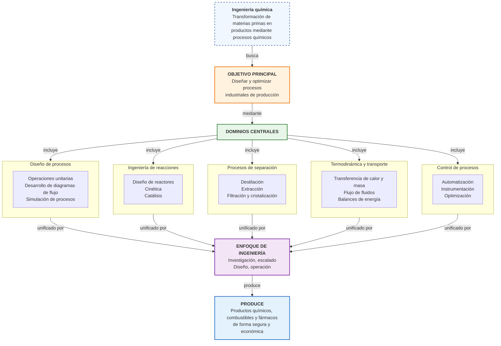

```mermaid
flowchart TD
    A[<b>Ingeniería química</b><br>Transformación de materias primas en<br>productos mediante procesos químicos]:::title
    B[<b>OBJETIVO PRINCIPAL</b><br>Diseñar y optimizar procesos<br>industriales de producción]:::objective
    C[<b>DOMINIOS CENTRALES</b>]:::domains
    
    subgraph D[Diseño de procesos]
        D1[Operaciones unitarias<br>Desarrollo de diagramas de flujo<br>Simulación de procesos]
    end
    
    subgraph E[Ingeniería de reacciones]
        E1[Diseño de reactores<br>Cinética<br>Catálisis]
    end
    
    subgraph F[Procesos de separación]
        F1[Destilación<br>Extracción<br>Filtración y cristalización]
    end
    
    subgraph G[Termodinámica y transporte]
        G1[Transferencia de calor y masa<br>Flujo de fluidos<br>Balances de energía]
    end
    
    subgraph H[Control de procesos]
        H1[Automatización<br>Instrumentación<br>Optimización]
    end
    
    I[<b>ENFOQUE DE INGENIERÍA</b><br>Investigación, escalado<br>Diseño, operación]:::approach
    
    J[<b>PRODUCE</b><br>Productos químicos, combustibles y fármacos<br>de forma segura y económica]:::outcome
    
    A -->|busca| B
    B -->|mediante| C
    C -->|incluye| D
    C -->|incluye| E
    C -->|incluye| F
    C -->|incluye| G
    C -->|incluye| H
    D & E & F & G & H -->|unificado por| I
    I -->|produce| J
    
    classDef title fill:#f0f7ff,stroke:#4a6fa5,stroke-width:2px,color:#333,stroke-dasharray: 5 5
    classDef objective fill:#fff3e0,stroke:#ef6c00,stroke-width:2px,color:#333
    classDef domains fill:#e8f5e9,stroke:#2e7d32,stroke-width:2px,color:#333
    classDef approach fill:#f3e5f5,stroke:#7b1fa2,stroke-width:2px,color:#333
    classDef outcome fill:#e3f2fd,stroke:#1565c0,stroke-width:2px,color:#333
```
