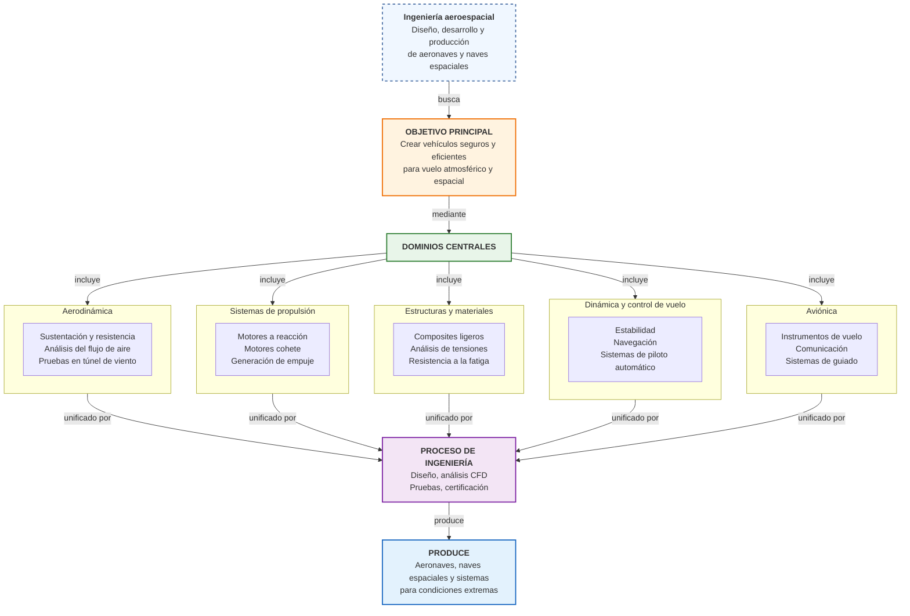

```mermaid
flowchart TD
    A[<b>Ingeniería aeroespacial</b><br>Diseño, desarrollo y producción<br>de aeronaves y naves espaciales]:::title
    B[<b>OBJETIVO PRINCIPAL</b><br>Crear vehículos seguros y eficientes<br>para vuelo atmosférico y espacial]:::objective
    C[<b>DOMINIOS CENTRALES</b>]:::domains
    
    subgraph D[Aerodinámica]
        D1[Sustentación y resistencia<br>Análisis del flujo de aire<br>Pruebas en túnel de viento]
    end
    
    subgraph E[Sistemas de propulsión]
        E1[Motores a reacción<br>Motores cohete<br>Generación de empuje]
    end
    
    subgraph F[Estructuras y materiales]
        F1[Composites ligeros<br>Análisis de tensiones<br>Resistencia a la fatiga]
    end
    
    subgraph G[Dinámica y control de vuelo]
        G1[Estabilidad<br>Navegación<br>Sistemas de piloto automático]
    end
    
    subgraph H[Aviónica]
        H1[Instrumentos de vuelo<br>Comunicación<br>Sistemas de guiado]
    end
    
    I[<b>PROCESO DE INGENIERÍA</b><br>Diseño, análisis CFD<br>Pruebas, certificación]:::process
    
    J[<b>PRODUCE</b><br>Aeronaves, naves espaciales y sistemas<br>para condiciones extremas]:::outcome
    
    A -->|busca| B
    B -->|mediante| C
    C -->|incluye| D
    C -->|incluye| E
    C -->|incluye| F
    C -->|incluye| G
    C -->|incluye| H
    D & E & F & G & H -->|unificado por| I
    I -->|produce| J
    
    classDef title fill:#f0f7ff,stroke:#4a6fa5,stroke-width:2px,color:#333,stroke-dasharray: 5 5
    classDef objective fill:#fff3e0,stroke:#ef6c00,stroke-width:2px,color:#333
    classDef domains fill:#e8f5e9,stroke:#2e7d32,stroke-width:2px,color:#333
    classDef process fill:#f3e5f5,stroke:#7b1fa2,stroke-width:2px,color:#333
    classDef outcome fill:#e3f2fd,stroke:#1565c0,stroke-width:2px,color:#333
```
