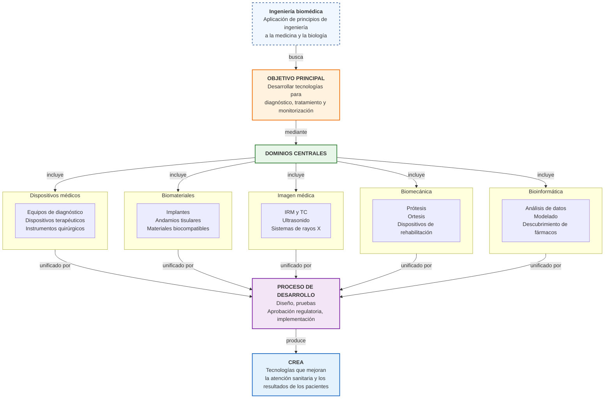

```mermaid
flowchart TD
    A[<b>Ingeniería biomédica</b><br>Aplicación de principios de ingeniería<br>a la medicina y la biología]:::title
    B[<b>OBJETIVO PRINCIPAL</b><br>Desarrollar tecnologías para<br>diagnóstico, tratamiento y monitorización]:::objective
    C[<b>DOMINIOS CENTRALES</b>]:::domains
    
    subgraph D[Dispositivos médicos]
        D1[Equipos de diagnóstico<br>Dispositivos terapéuticos<br>Instrumentos quirúrgicos]
    end
    
    subgraph E[Biomateriales]
        E1[Implantes<br>Andamios tisulares<br>Materiales biocompatibles]
    end
    
    subgraph F[Imagen médica]
        F1[IRM y TC<br>Ultrasonido<br>Sistemas de rayos X]
    end
    
    subgraph G[Biomecánica]
        G1[Prótesis<br>Ortesis<br>Dispositivos de rehabilitación]
    end
    
    subgraph H[Bioinformática]
        H1[Análisis de datos<br>Modelado<br>Descubrimiento de fármacos]
    end
    
    I[<b>PROCESO DE DESARROLLO</b><br>Diseño, pruebas<br>Aprobación regulatoria, implementación]:::process
    
    J[<b>CREA</b><br>Tecnologías que mejoran<br>la atención sanitaria y los resultados de los pacientes]:::outcome
    
    A -->|busca| B
    B -->|mediante| C
    C -->|incluye| D
    C -->|incluye| E
    C -->|incluye| F
    C -->|incluye| G
    C -->|incluye| H
    D & E & F & G & H -->|unificado por| I
    I -->|produce| J
    
    classDef title fill:#f0f7ff,stroke:#4a6fa5,stroke-width:2px,color:#333,stroke-dasharray: 5 5
    classDef objective fill:#fff3e0,stroke:#ef6c00,stroke-width:2px,color:#333
    classDef domains fill:#e8f5e9,stroke:#2e7d32,stroke-width:2px,color:#333
    classDef process fill:#f3e5f5,stroke:#7b1fa2,stroke-width:2px,color:#333
    classDef outcome fill:#e3f2fd,stroke:#1565c0,stroke-width:2px,color:#333
```
