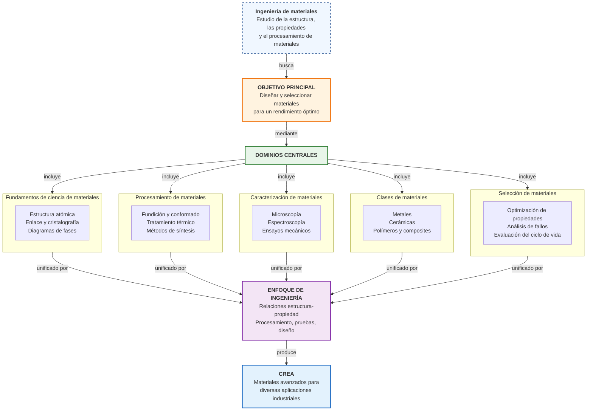

```mermaid
flowchart TD
    A[<b>Ingeniería de materiales</b><br>Estudio de la estructura, las propiedades<br>y el procesamiento de materiales]:::title
    B[<b>OBJETIVO PRINCIPAL</b><br>Diseñar y seleccionar materiales<br>para un rendimiento óptimo]:::objective
    C[<b>DOMINIOS CENTRALES</b>]:::domains
    
    subgraph D[Fundamentos de ciencia de materiales]
        D1[Estructura atómica<br>Enlace y cristalografía<br>Diagramas de fases]
    end
    
    subgraph E[Procesamiento de materiales]
        E1[Fundición y conformado<br>Tratamiento térmico<br>Métodos de síntesis]
    end
    
    subgraph F[Caracterización de materiales]
        F1[Microscopía<br>Espectroscopía<br>Ensayos mecánicos]
    end
    
    subgraph G[Clases de materiales]
        G1[Metales<br>Cerámicas<br>Polímeros y composites]
    end
    
    subgraph H[Selección de materiales]
        H1[Optimización de propiedades<br>Análisis de fallos<br>Evaluación del ciclo de vida]
    end
    
    I[<b>ENFOQUE DE INGENIERÍA</b><br>Relaciones estructura-propiedad<br>Procesamiento, pruebas, diseño]:::approach
    
    J[<b>CREA</b><br>Materiales avanzados para<br>diversas aplicaciones industriales]:::outcome
    
    A -->|busca| B
    B -->|mediante| C
    C -->|incluye| D
    C -->|incluye| E
    C -->|incluye| F
    C -->|incluye| G
    C -->|incluye| H
    D & E & F & G & H -->|unificado por| I
    I -->|produce| J
    
    classDef title fill:#f0f7ff,stroke:#4a6fa5,stroke-width:2px,color:#333,stroke-dasharray: 5 5
    classDef objective fill:#fff3e0,stroke:#ef6c00,stroke-width:2px,color:#333
    classDef domains fill:#e8f5e9,stroke:#2e7d32,stroke-width:2px,color:#333
    classDef approach fill:#f3e5f5,stroke:#7b1fa2,stroke-width:2px,color:#333
    classDef outcome fill:#e3f2fd,stroke:#1565c0,stroke-width:2px,color:#333
```
