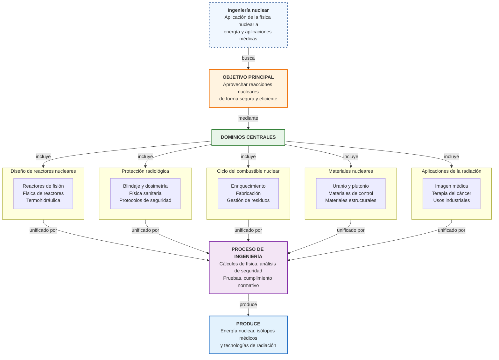

```mermaid
flowchart TD
    A[<b>Ingeniería nuclear</b><br>Aplicación de la física nuclear a<br>energía y aplicaciones médicas]:::title
    B[<b>OBJETIVO PRINCIPAL</b><br>Aprovechar reacciones nucleares<br>de forma segura y eficiente]:::objective
    C[<b>DOMINIOS CENTRALES</b>]:::domains
    
    subgraph D[Diseño de reactores nucleares]
        D1[Reactores de fisión<br>Física de reactores<br>Termohidráulica]
    end
    
    subgraph E[Protección radiológica]
        E1[Blindaje y dosimetría<br>Física sanitaria<br>Protocolos de seguridad]
    end
    
    subgraph F[Ciclo del combustible nuclear]
        F1[Enriquecimiento<br>Fabricación<br>Gestión de residuos]
    end
    
    subgraph G[Materiales nucleares]
        G1[Uranio y plutonio<br>Materiales de control<br>Materiales estructurales]
    end
    
    subgraph H[Aplicaciones de la radiación]
        H1[Imagen médica<br>Terapia del cáncer<br>Usos industriales]
    end
    
    I[<b>PROCESO DE INGENIERÍA</b><br>Cálculos de física, análisis de seguridad<br>Pruebas, cumplimiento normativo]:::process
    
    J[<b>PRODUCE</b><br>Energía nuclear, isótopos médicos<br>y tecnologías de radiación]:::outcome
    
    A -->|busca| B
    B -->|mediante| C
    C -->|incluye| D
    C -->|incluye| E
    C -->|incluye| F
    C -->|incluye| G
    C -->|incluye| H
    D & E & F & G & H -->|unificado por| I
    I -->|produce| J
    
    classDef title fill:#f0f7ff,stroke:#4a6fa5,stroke-width:2px,color:#333,stroke-dasharray: 5 5
    classDef objective fill:#fff3e0,stroke:#ef6c00,stroke-width:2px,color:#333
    classDef domains fill:#e8f5e9,stroke:#2e7d32,stroke-width:2px,color:#333
    classDef process fill:#f3e5f5,stroke:#7b1fa2,stroke-width:2px,color:#333
    classDef outcome fill:#e3f2fd,stroke:#1565c0,stroke-width:2px,color:#333
```
