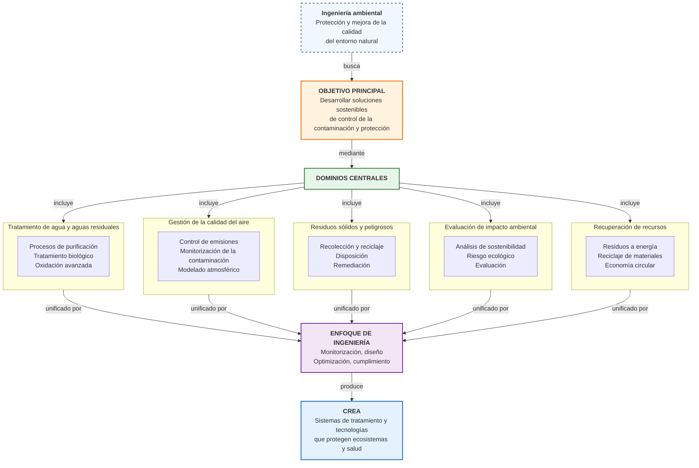

```mermaid
flowchart TD
    A[<b>Ingeniería ambiental</b><br>Protección y mejora de la calidad<br>del entorno natural]:::title
    B[<b>OBJETIVO PRINCIPAL</b><br>Desarrollar soluciones sostenibles<br>de control de la contaminación y protección]:::objective
    C[<b>DOMINIOS CENTRALES</b>]:::domains
    
    subgraph D[Tratamiento de agua y aguas residuales]
        D1[Procesos de purificación<br>Tratamiento biológico<br>Oxidación avanzada]
    end
    
    subgraph E[Gestión de la calidad del aire]
        E1[Control de emisiones<br>Monitorización de la contaminación<br>Modelado atmosférico]
    end
    
    subgraph F[Residuos sólidos y peligrosos]
        F1[Recolección y reciclaje<br>Disposición<br>Remediación]
    end
    
    subgraph G[Evaluación de impacto ambiental]
        G1[Análisis de sostenibilidad<br>Riesgo ecológico<br>Evaluación]
    end
    
    subgraph H[Recuperación de recursos]
        H1[Residuos a energía<br>Reciclaje de materiales<br>Economía circular]
    end
    
    I[<b>ENFOQUE DE INGENIERÍA</b><br>Monitorización, diseño<br>Optimización, cumplimiento]:::approach
    
    J[<b>CREA</b><br>Sistemas de tratamiento y tecnologías<br>que protegen ecosistemas y salud]:::outcome
    
    A -->|busca| B
    B -->|mediante| C
    C -->|incluye| D
    C -->|incluye| E
    C -->|incluye| F
    C -->|incluye| G
    C -->|incluye| H
    D & E & F & G & H -->|unificado por| I
    I -->|produce| J
    
    classDef title fill:#f0f7ff,stroke:#4a6fa5,stroke-width:2px,color:#333,stroke-dasharray: 5 5
    classDef objective fill:#fff3e0,stroke:#ef6c00,stroke-width:2px,color:#333
    classDef domains fill:#e8f5e9,stroke:#2e7d32,stroke-width:2px,color:#333
    classDef approach fill:#f3e5f5,stroke:#7b1fa2,stroke-width:2px,color:#333
    classDef outcome fill:#e3f2fd,stroke:#1565c0,stroke-width:2px,color:#333
```
