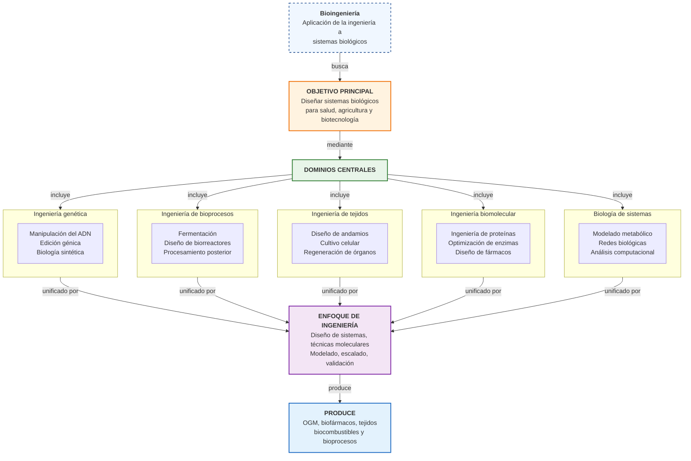

```mermaid
flowchart TD
    A[<b>Bioingeniería</b><br>Aplicación de la ingeniería a<br>sistemas biológicos]:::title
    B[<b>OBJETIVO PRINCIPAL</b><br>Diseñar sistemas biológicos<br>para salud, agricultura y biotecnología]:::objective
    C[<b>DOMINIOS CENTRALES</b>]:::domains
    
    subgraph D[Ingeniería genética]
        D1[Manipulación del ADN<br>Edición génica<br>Biología sintética]
    end
    
    subgraph E[Ingeniería de bioprocesos]
        E1[Fermentación<br>Diseño de biorreactores<br>Procesamiento posterior]
    end
    
    subgraph F[Ingeniería de tejidos]
        F1[Diseño de andamios<br>Cultivo celular<br>Regeneración de órganos]
    end
    
    subgraph G[Ingeniería biomolecular]
        G1[Ingeniería de proteínas<br>Optimización de enzimas<br>Diseño de fármacos]
    end
    
    subgraph H[Biología de sistemas]
        H1[Modelado metabólico<br>Redes biológicas<br>Análisis computacional]
    end
    
    I[<b>ENFOQUE DE INGENIERÍA</b><br>Diseño de sistemas, técnicas moleculares<br>Modelado, escalado, validación]:::approach
    
    J[<b>PRODUCE</b><br>OGM, biofármacos, tejidos<br>biocombustibles y bioprocesos]:::outcome
    
    A -->|busca| B
    B -->|mediante| C
    C -->|incluye| D
    C -->|incluye| E
    C -->|incluye| F
    C -->|incluye| G
    C -->|incluye| H
    D & E & F & G & H -->|unificado por| I
    I -->|produce| J
    
    classDef title fill:#f0f7ff,stroke:#4a6fa5,stroke-width:2px,color:#333,stroke-dasharray: 5 5
    classDef objective fill:#fff3e0,stroke:#ef6c00,stroke-width:2px,color:#333
    classDef domains fill:#e8f5e9,stroke:#2e7d32,stroke-width:2px,color:#333
    classDef approach fill:#f3e5f5,stroke:#7b1fa2,stroke-width:2px,color:#333
    classDef outcome fill:#e3f2fd,stroke:#1565c0,stroke-width:2px,color:#333
```
