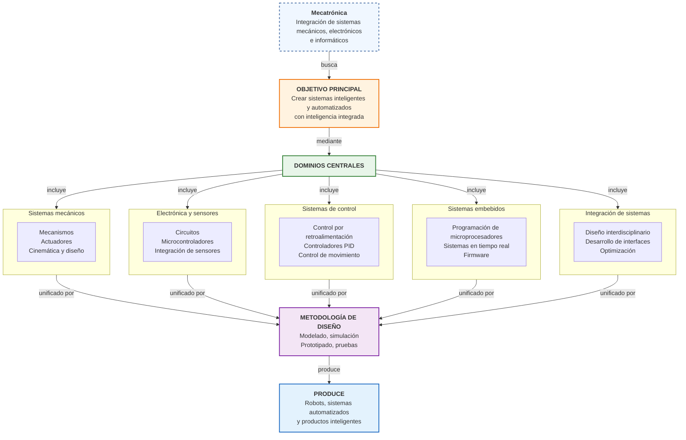

```mermaid
flowchart TD
    A[<b>Mecatrónica</b><br>Integración de sistemas mecánicos, electrónicos<br>e informáticos]:::title
    B[<b>OBJETIVO PRINCIPAL</b><br>Crear sistemas inteligentes y automatizados<br>con inteligencia integrada]:::objective
    C[<b>DOMINIOS CENTRALES</b>]:::domains
    
    subgraph D[Sistemas mecánicos]
        D1[Mecanismos<br>Actuadores<br>Cinemática y diseño]
    end
    
    subgraph E[Electrónica y sensores]
        E1[Circuitos<br>Microcontroladores<br>Integración de sensores]
    end
    
    subgraph F[Sistemas de control]
        F1[Control por retroalimentación<br>Controladores PID<br>Control de movimiento]
    end
    
    subgraph G[Sistemas embebidos]
        G1[Programación de microprocesadores<br>Sistemas en tiempo real<br>Firmware]
    end
    
    subgraph H[Integración de sistemas]
        H1[Diseño interdisciplinario<br>Desarrollo de interfaces<br>Optimización]
    end
    
    I[<b>METODOLOGÍA DE DISEÑO</b><br>Modelado, simulación<br>Prototipado, pruebas]:::methodology
    
    J[<b>PRODUCE</b><br>Robots, sistemas automatizados<br>y productos inteligentes]:::outcome
    
    A -->|busca| B
    B -->|mediante| C
    C -->|incluye| D
    C -->|incluye| E
    C -->|incluye| F
    C -->|incluye| G
    C -->|incluye| H
    D & E & F & G & H -->|unificado por| I
    I -->|produce| J
    
    classDef title fill:#f0f7ff,stroke:#4a6fa5,stroke-width:2px,color:#333,stroke-dasharray: 5 5
    classDef objective fill:#fff3e0,stroke:#ef6c00,stroke-width:2px,color:#333
    classDef domains fill:#e8f5e9,stroke:#2e7d32,stroke-width:2px,color:#333
    classDef methodology fill:#f3e5f5,stroke:#7b1fa2,stroke-width:2px,color:#333
    classDef outcome fill:#e3f2fd,stroke:#1565c0,stroke-width:2px,color:#333
```
