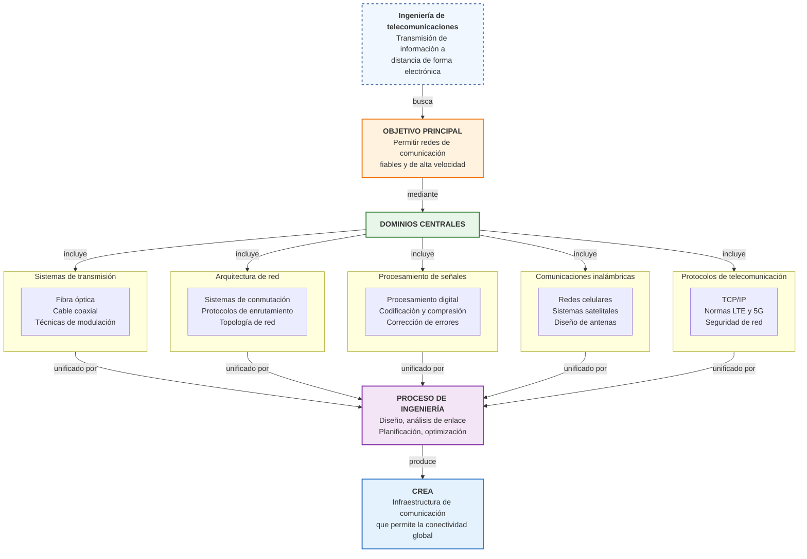

```mermaid
flowchart TD
    A[<b>Ingeniería de telecomunicaciones</b><br>Transmisión de información a<br>distancia de forma electrónica]:::title
    B[<b>OBJETIVO PRINCIPAL</b><br>Permitir redes de comunicación<br>fiables y de alta velocidad]:::objective
    C[<b>DOMINIOS CENTRALES</b>]:::domains
    
    subgraph D[Sistemas de transmisión]
        D1[Fibra óptica<br>Cable coaxial<br>Técnicas de modulación]
    end
    
    subgraph E[Arquitectura de red]
        E1[Sistemas de conmutación<br>Protocolos de enrutamiento<br>Topología de red]
    end
    
    subgraph F[Procesamiento de señales]
        F1[Procesamiento digital<br>Codificación y compresión<br>Corrección de errores]
    end
    
    subgraph G[Comunicaciones inalámbricas]
        G1[Redes celulares<br>Sistemas satelitales<br>Diseño de antenas]
    end
    
    subgraph H[Protocolos de telecomunicación]
        H1[TCP/IP<br>Normas LTE y 5G<br>Seguridad de red]
    end
    
    I[<b>PROCESO DE INGENIERÍA</b><br>Diseño, análisis de enlace<br>Planificación, optimización]:::process
    
    J[<b>CREA</b><br>Infraestructura de comunicación<br>que permite la conectividad global]:::outcome
    
    A -->|busca| B
    B -->|mediante| C
    C -->|incluye| D
    C -->|incluye| E
    C -->|incluye| F
    C -->|incluye| G
    C -->|incluye| H
    D & E & F & G & H -->|unificado por| I
    I -->|produce| J
    
    classDef title fill:#f0f7ff,stroke:#4a6fa5,stroke-width:2px,color:#333,stroke-dasharray: 5 5
    classDef objective fill:#fff3e0,stroke:#ef6c00,stroke-width:2px,color:#333
    classDef domains fill:#e8f5e9,stroke:#2e7d32,stroke-width:2px,color:#333
    classDef process fill:#f3e5f5,stroke:#7b1fa2,stroke-width:2px,color:#333
    classDef outcome fill:#e3f2fd,stroke:#1565c0,stroke-width:2px,color:#333
```
